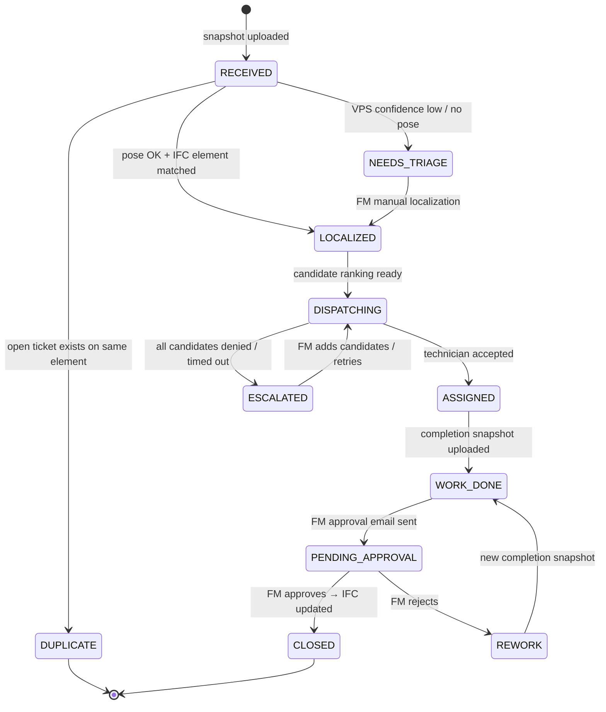
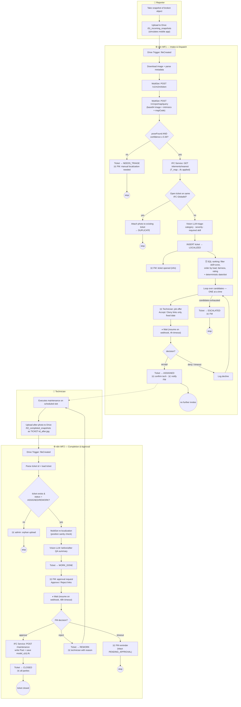
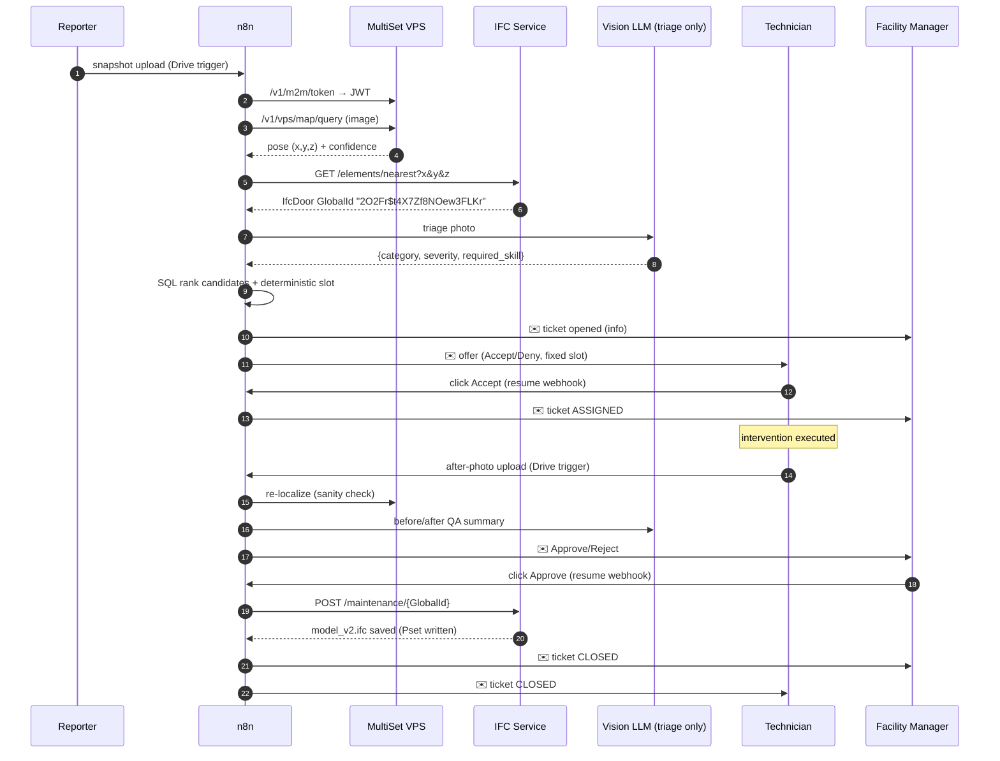

# Community-Based Maintenance (CBM) — AI Agent Ticketing System
## Design Document & n8n Implementation Guide

**Version:** 1.0 (Proof of Concept) · **Target orchestrator:** n8n · **Scope:** single room / single IFC model

---

## 1. System overview

The system turns any building occupant into a maintenance sensor. A photo of a broken object becomes a fully localized, dispatched, executed, verified and **BIM-documented** maintenance intervention, with the Facility Manager (FM) keeping the final word.

### 1.1 Actors

| Actor | Role | Interaction channel |
|---|---|---|
| **Reporter** (any occupant) | Takes the "broken object" snapshot | Mobile app (simulated: Google Drive upload) |
| **CBM Platform** (n8n + AI agent) | Orchestrates the whole lifecycle | — |
| **MultiSet VPS** | Localizes the snapshot → 6-DoF pose in the building map | REST API (`api.multiset.ai`) |
| **IFC Service** | Maps pose → IFC element; writes maintenance records into the IFC | Custom FastAPI microservice (IfcOpenShell) |
| **AI (vision LLM)** | Triages the photo (category, severity, required skill) and QA-summarizes before/after evidence. **Not** used for technician selection, which is deterministic SQL | HTTP calls to a vision LLM |
| **Technician** | Accepts/denies, executes work, uploads completion snapshot | Email (accept/deny links), Drive upload |
| **Facility Manager** | Informed at opening; approves/rejects the completed work → closes ticket | Email (approve/reject links) |

### 1.2 External systems and why they were chosen

- **MultiSet VPS** — exposes a documented REST API: token exchange (`POST /v1/m2m/token` with `clientId`/`clientSecret` → JWT) and map query (`POST /v1/vps/map/query`) that accepts a base64 image + camera intrinsics + `mapCode` and returns `{poseFound, position{x,y,z}, rotation, confidence, mapCodes}`. This means **n8n can call it with a plain HTTP Request node — no MCP server is required for the PoC** (see §6.1 for when MCP *does* make sense).
- **PostgreSQL** — tickets, technicians, event log. Chosen over Google Sheets because we need transactional status updates (the "no double dispatch" constraint is a concurrency problem) and because deterministic, auditable candidate ranking is a single SQL query (and it upgrades cleanly to `pgvector` if document-level RAG is ever added).
- **Gmail** — technician offers and FM notifications. Accept/Deny and Approve/Reject are plain HTTPS links that resume a paused n8n execution (`Wait` node in *resume-on-webhook* mode). No app needed on the technician side.
- **IFC Service (FastAPI + IfcOpenShell)** — n8n cannot parse IFC files natively. IfcOpenShell is the de-facto open-source standard for programmatic IFC manipulation and is what the literature on BIM-based maintenance management systems (BIM-FM/CMMS integration, COBie pipelines) builds on. Two endpoints: nearest-element lookup and maintenance-record writing.

### 1.3 The coordinate-frame problem (critical, easy to miss)

MultiSet returns poses in the **map's left-handed (Unity-style) local coordinate system**; IFC uses a **right-handed, Z-up** frame anchored at the project origin. These frames will *not* coincide. The design therefore includes a one-time **calibration transform** `T_map→ifc` (a 4×4 homogeneous matrix stored in the IFC service config), obtained by surveying ≥3 corresponding points (e.g., door corners) in both the MultiSet map and the IFC model, then solving the rigid transform (Kabsch/Umeyama). Every VPS pose is transformed before the nearest-element query. Skipping this step is the most likely silent failure mode of the whole pipeline.

> Alternative: georeference the MultiSet map to WGS 84 (supported natively) *and* georeference the IFC (IfcSite lat/long + true north). Cleaner long-term, more setup for a PoC. For one room, the 4×4 matrix wins.

---

## 2. Ticket lifecycle (state machine)

Every ticket moves through an explicit state machine. **Motivation:** community reporting is chaotic (duplicates, retries, stale links); an explicit state machine plus an append-only event log gives idempotency, auditability, and SLA measurement for free — and it is what any real CMMS/CAFM expects if you integrate later.

---

## 3. End-to-end workflow design

### 3.1 Phase A — Intake & localization (trigger: "New Ticket Opened")

1. **Trigger.** A photo lands in Drive folder `01_incoming_snapshots` (simulating the mobile app). Filename convention for the PoC: `report_<reporterEmail>_<freeText>.jpg`. In production the app calls an n8n Webhook directly with image + device camera intrinsics + a coarse position hint.
2. **Localize.** n8n gets a MultiSet JWT, then calls the VPS map query with the base64 image. The response carries a `confidence` score — we gate on it (default threshold 0.30, tune empirically). *Improvement & motivation:* a single reporter photo may fail to localize (motion blur, texture-poor wall). Rather than failing the ticket, low confidence routes to `NEEDS_TRIAGE` with an FM email — human-in-the-loop fallback keeps the funnel alive. MultiSet also offers a multi-image query (4–6 frames) that is more robust; the production app should capture a short burst.
3. **Pose → IFC element.** The IFC service applies `T_map→ifc`, finds the nearest maintainable element (`IfcDoor`, `IfcWindow`, `IfcSanitaryTerminal`, `IfcFurnishingElement`, …) within a search radius (default 1.5 m) and returns its `GlobalId`, class, name and storey. If nothing is within radius → room-level ticket (see Scenario S8).
4. **Deduplicate.** If an open ticket already exists on that `GlobalId`, attach the new photo as supporting evidence and stop. *Motivation:* "community-based" means ten people will photograph the same broken door on Monday morning; without dedup you dispatch ten technicians.
5. **AI vision triage.** A vision LLM classifies the photo → `{category, severity 1–5, short description, required_skill}`. *Motivation:* `required_skill` is the join key of the whole dispatch phase — it is what the SQL eligibility filter matches against `technicians.skills` ("door hinge, carpentry, severity 3" selects a carpenter, not a plumber) — and it gives the FM an informative notification instead of a bare photo.
6. **Create ticket** (`LOCALIZED`) and **notify the FM** (informational — per your spec the FM is contacted at opening, in parallel with dispatch).

### 3.2 Phase B — Autonomous technician dispatch

7. **Candidate ranking (deterministic SQL).** Selection is a single Postgres query, not an LLM/RAG step. **Eligibility** is enforced by hard filters — `active = TRUE`, `required_skill = ANY(skills)`, `zone` match — so an unqualified technician can never enter the candidate set. **Ranking** within the eligible set is a deterministic, auditable `ORDER BY` with three tiers:
   1. `open_jobs ASC` — load balancing: technicians with fewer open tickets first;
   2. `last_assigned_at ASC NULLS FIRST` — **fairness / cold-start rule**: a newly onboarded technician has `NULL` here and is therefore ranked *first*, guaranteeing new members get work instead of being starved by history-based scoring;
   3. `rating DESC` — quality as the final tie-breaker.

   The proposed date + fixed slot are computed deterministically from severity (≥4 → next business day 08:00–10:00, else +2 business days 14:00–16:00). *Motivation:* for triaged, categorised interventions (a fire door labelled EI 120 still just needs a door technician — the code is a spec, not a skill), semantic matching adds non-determinism, cost and a cold-start bias without adding eligibility precision. Every dispatch decision is reproducible and explainable from the row values (§6.2).
8. **Sequential offer loop.** Candidates are contacted **one at a time**. The offer email contains exactly two links — **Accept** and **Deny** — pointing at the paused execution's resume URL. A `Wait` node pauses with a 4-hour timeout.
   - **Accept** → ticket `ASSIGNED`, confirmation to technician, notification to FM, **loop exits — no other technician is ever contacted** (Constraint 1 ✔).
   - **Deny or timeout** → log the decline, loop advances to the next candidate.
   - The email states the fixed date/slot; there is no reschedule affordance anywhere (Constraint 2 ✔).
   - **All candidates exhausted** → ticket `ESCALATED`, FM notified. *Motivation:* without this exit the constraint "no parallel invites" can deadlock the ticket forever.

### 3.3 Phase C — Completion, approval, IFC update

9. **Completion trigger.** Technician uploads the "after" photo to Drive folder `02_completed_snapshots`, named `TICKET-<id>_after.jpg`.
10. **Location verification (improvement).** The after-photo is localized via MultiSet too; if the pose is > 3 m from the ticket's stored position, flag it in the FM email. *Motivation:* cheap fraud/error check — proves the technician photographed the right object.
11. **AI QA summary (improvement).** Vision LLM compares before/after and writes a 2-line assessment. *Motivation:* decision support only — the FM stays the sole decision-maker (Constraint 3 ✔), but arrives at the decision with context.
12. **FM approval.** Email with before/after + Approve/Reject links; `Wait` (48 h timeout, then reminder).
    - **Approve** → the IFC service writes a property set on the element (`CBM_MaintenanceRecord`: ticket id, dates, technician, description, photo refs, VPS confidence) and saves a **new versioned IFC file** (`model_v{n}.ifc`, non-destructive). Ticket → `CLOSED`; everyone notified.
    - **Reject** → ticket → `REWORK`; technician notified with the FM's reason; a new after-photo re-enters Phase C.

**Why Pset-based IFC updates rather than geometry edits (design decision):** maintenance history belongs in properties (this is exactly the COBie / IFC-FM handover philosophy, and what BIM-CMMS literature implements). Rewriting geometry on every intervention bloats and risks corrupting the model; geometry/type replacement is only justified when the physical asset is actually replaced (door swapped for a different model) — supported as a second endpoint but out of PoC scope. Versioned saves give a full history and safe rollback.

---

## 4. Main workflow diagram (Mermaid)

### 4.1 Happy-path sequence

---

## 5. Scenario catalogue

| # | Scenario | Path through the system | Outcome |
|---|---|---|---|
| S1 | Happy path | A → B → C, first technician accepts, FM approves | `CLOSED`, IFC v+1 |
| S2 | Blurry photo / texture-poor scene | VPS `poseFound=false` or confidence < 0.30 | `NEEDS_TRIAGE`, FM localizes manually |
| S3 | Ten reports of the same door | Dedup on IFC `GlobalId` with open ticket | 1 ticket, 9 `DUPLICATE` (photos attached) |
| S4 | Technician #1 denies | Loop advances sequentially | Offer to #2; #1's link is dead (single-use execution) |
| S5 | Nobody accepts / all time out | Loop exhausts candidate list | `ESCALATED`, FM decides manually |
| S6 | FM rejects the work | Reject link | `REWORK`, technician re-uploads, Phase C repeats |
| S7 | FM doesn't respond in 48 h | Wait timeout | Reminder email, stays `PENDING_APPROVAL` |
| S8 | Pose valid but no IFC element within 1.5 m | IFC service returns storey/space only | Room-level ticket, element field = `IfcSpace` GlobalId |
| S9 | Two reporters upload simultaneously | DB `INSERT … WHERE NOT EXISTS` guard | Exactly one ticket wins (transactional dedup) |
| S10 | Asset physically replaced (not just repaired) | Out of PoC scope; second IFC endpoint | Geometry/type swap + Pset, documented in §6.4 |

## 5.1 Constraint compliance map

| Your constraint | Enforcement mechanism |
|---|---|
| 1. No invite to others once accepted | Strictly **sequential** loop (batch size 1) + `Wait` pause: at any instant at most one live offer exists; Accept branch never re-enters the loop |
| 2. Technician cannot change/propose date | Offer email contains only Accept/Deny links with a fixed slot; the resume webhook ignores any other parameter |
| 3. FM has final closure decision | `CLOSED` is reachable **only** through the FM Approve webhook; IFC write happens strictly after approval |

---

## 6. Improvements & open points (each with motivation)

### 6.1 MultiSet ↔ n8n: HTTP now, MCP later
For a deterministic pipeline step ("localize this image"), a plain HTTP Request node is simpler, cheaper and more debuggable than MCP. MCP becomes valuable when you want the **agent** to *choose* to localize as a tool ("figure out where this photo was taken, then decide what to do") — n8n ships a native **MCP Client Tool** node, so the migration is: wrap the two MultiSet calls in a ~50-line FastMCP server exposing a `localize_image` tool, and attach it to an AI Agent node. Recommendation: ship the PoC on HTTP; revisit MCP only if you later introduce an agentic loop.

### 6.2 Technician selection is deterministic SQL — RAG deliberately excluded
**Decision:** selection uses no LLM and no embeddings. Eligibility (skill, zone, active) is hard SQL filtering; ranking is `ORDER BY open_jobs ASC, last_assigned_at ASC NULLS FIRST, rating DESC`.

**Why:**
1. **Guarantees over similarity.** `skill = ANY(skills)` returns zero unqualified candidates, ever; a similarity search returns the *nearest* profiles, and nearest ≠ eligible.
2. **Auditability.** "Why was X dispatched and not Y?" is answered by three row values, reproducibly — a requirement in facility management, where dispatch decisions get contested.
3. **Cold-start fairness.** History-based scoring (including RAG over past intervention reports) structurally starves new technicians, who have no documents to retrieve. `last_assigned_at ASC NULLS FIRST` inverts this: never-assigned technicians are ranked *first*. Load balancing (`open_jobs ASC`) reinforces it.
4. **Specificity is not required.** Routine facility maintenance is fully described by (category, required_skill, severity). Certification codes on assets (e.g. an EI 120 fire-rated door) specify the *product*, not an exotic skill — any doors/carpentry technician qualifies. If a legally certified skill ever becomes a dispatch criterion (electrical, F-gas), it belongs in the structured `skills` array as a hard filter — precisely *not* in fuzzy retrieval.

**What was removed vs. the first draft:** the AI Agent node (+ chat model, DB tool, structured-output parser) is replaced by one Postgres node + one IF node. Note that merely *deactivating* the agent node in n8n would **not** work: downstream nodes consume its `{candidates[], proposed_date, proposed_slot}` output, so a disabled node breaks the data contract mid-pipeline. The replacement preserves the contract (Split Candidates now produces the identical item shape), so everything from the offer loop onward is untouched.

**If RAG returns later**, its correct role is document intelligence, not selection: retrieving past intervention reports, manuals, and certificates *about the asset or the fix* to enrich the offer email or the FM's approval context — layered strictly after the SQL eligibility gate (metadata-filtered by `technician_id`), never replacing it. The commented `vector(1536)` column in the schema marks that upgrade path without paying its complexity now.

### 6.3 Trigger simulation → production
Drive-folder triggers are polling-based (≈1 min latency) and depend on filename conventions — fine for the PoC, fragile in production. The upgrade is mechanical: replace both Drive triggers with n8n **Webhook** triggers; the mobile app POSTs the image plus real camera intrinsics (fx, fy, px, py — MultiSet requires them, and real values markedly beat the hard-coded defaults used in the PoC) and a `hintPosition`/`geoHint` for faster, more accurate VPS queries.

### 6.4 IFC strategy
(a) **Repairs** → append-only `CBM_MaintenanceRecord` Psets, versioned file saves (implemented). (b) **Replacements** → `IfcRelDefinesByType` swap + geometry update (documented endpoint stub). (c) Long-term: express interventions as `IfcTask`/`IfcWorkSchedule` entities for full 7D-BIM compliance, and consider Map Versioning on the MultiSet side after renovations so VPS anchors keep matching the new geometry.

### 6.5 Security of email links
Resume URLs are unguessable but bearer-style: anyone with the link can click it. For the PoC that's acceptable; for production append a signed one-time token (`?sig=HMAC(ticketId, technicianId, exp)`) validated in a Code node before honoring the decision, and expire links when the loop advances.

### 6.6 Scheduling realism
The PoC proposes "next business day, 09:00–11:00" uniformly. The current rule is deterministic (severity ≥4 → next business day 08:00–10:00, else +2 business days 14:00–16:00). Production should replace it with a lookup against real technician availability — while still presenting the technician a single fixed slot, per Constraint 2. Note a subtlety: if candidate #1 burns 4 h before timing out, the slot proposed to candidate #2 may need recomputation; the PoC keeps the slot fixed, production should recompute inside the loop.

### 6.7 Observability
Every transition writes to `ticket_events` (append-only). This gives you: SLA dashboards (time-to-assign, time-to-close), dispute resolution ("technician says he never got the offer"), and the data needed to tune the ranking weights (load vs. fairness vs. rating) over time.

---

## 7. Implementation artifacts (what's in this package)

| File | Purpose |
|---|---|
| `02_main_workflow.mermaid` | Standalone main flowchart (same as §4) |
| `wf1_ticket_intake_and_dispatch.json` | n8n workflow — Phases A + B (import via *Workflows → Import from File*) |
| `wf2_completion_and_approval.json` | n8n workflow — Phase C |
| `ifc_service.py` | FastAPI + IfcOpenShell microservice: nearest-element lookup, Pset writing, versioned saves, `T_map→ifc` calibration hook |
| `schema.sql` | PostgreSQL schema: `tickets`, `technicians`, `ticket_events` (+ pgvector-ready column) |

### 7.1 Node-by-node notes (WF1)

| Node | Type | Notes |
|---|---|---|
| Drive Trigger | `googleDriveTrigger` | `fileCreated` on folder `01_incoming_snapshots`; set your folder ID |
| Download Snapshot | `googleDrive` | binary download |
| Prepare Image | `code` | binary → base64 data-URI; parses reporter email from filename |
| MultiSet Token | `httpRequest` | `POST /v1/m2m/token`; put clientId/secret in n8n credentials/env |
| MultiSet Localize | `httpRequest` | `POST /v1/vps/map/query`; PoC uses fixed intrinsics — replace with real ones |
| Confidence Gate | `if` | `poseFound && confidence ≥ 0.30` |
| Find IFC Element | `httpRequest` | `GET {IFC_SERVICE}/elements/nearest` |
| Duplicate Check | `postgres` | `SELECT` open ticket by `ifc_global_id` |
| Vision Triage | `httpRequest` | Anthropic Messages API, image block; returns strict JSON |
| Create Ticket | `postgres` | `INSERT … RETURNING id` |
| Notify FM (opened) | `gmail` | informational |
| Rank Candidates (SQL) | `postgres` | hard eligibility filters + `ORDER BY open_jobs, last_assigned_at NULLS FIRST, rating DESC`, LIMIT 5 |
| Candidates Found? | `if` | empty result → Mark Escalated + FM email (no silent stall) |
| Split Candidates | `code` | SQL rows → one item per candidate + deterministic date/slot from severity |
| Offer Loop | `splitInBatches` (size 1) | **sequential dispatch = Constraint 1** |
| Send Offer | `gmail` | Accept/Deny links = `{{$execution.resumeUrl}}?decision=…` |
| Wait For Decision | `wait` (webhook, 4 h limit) | resumes with `$json.query.decision` |
| Decision? | `if` | accept vs deny/timeout |
| Assign / Log Decline / Escalate | `postgres` + `gmail` | per §3.2 |

WF2 mirrors the table for Phase C (see JSON, nodes are annotated with sticky-note-style names).

### 7.2 Runbook (PoC)

1. `psql < schema.sql`, insert 3–5 demo technicians.
2. Prepare the room: scan with the MultiSet mapping app → note `mapCode`; export/author the room IFC (even a 4-wall + 1-door model from BlenderBIM is enough); survey 3 corresponding points → compute `T_map→ifc`; put both into `ifc_service` env.
3. `pip install fastapi uvicorn ifcopenshell numpy && uvicorn ifc_service:app --port 8000`.
4. Import both workflow JSONs into n8n; attach your Google Drive, Gmail, Postgres, Anthropic and MultiSet (generic header auth) credentials; set the three placeholder env values (`IFC_SERVICE_URL`, `MULTISET_MAP_CODE`, folder IDs); activate.
5. Drop a photo into `01_incoming_snapshots` → watch the execution.
