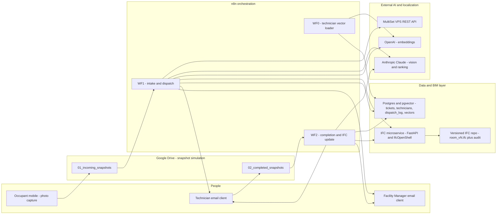
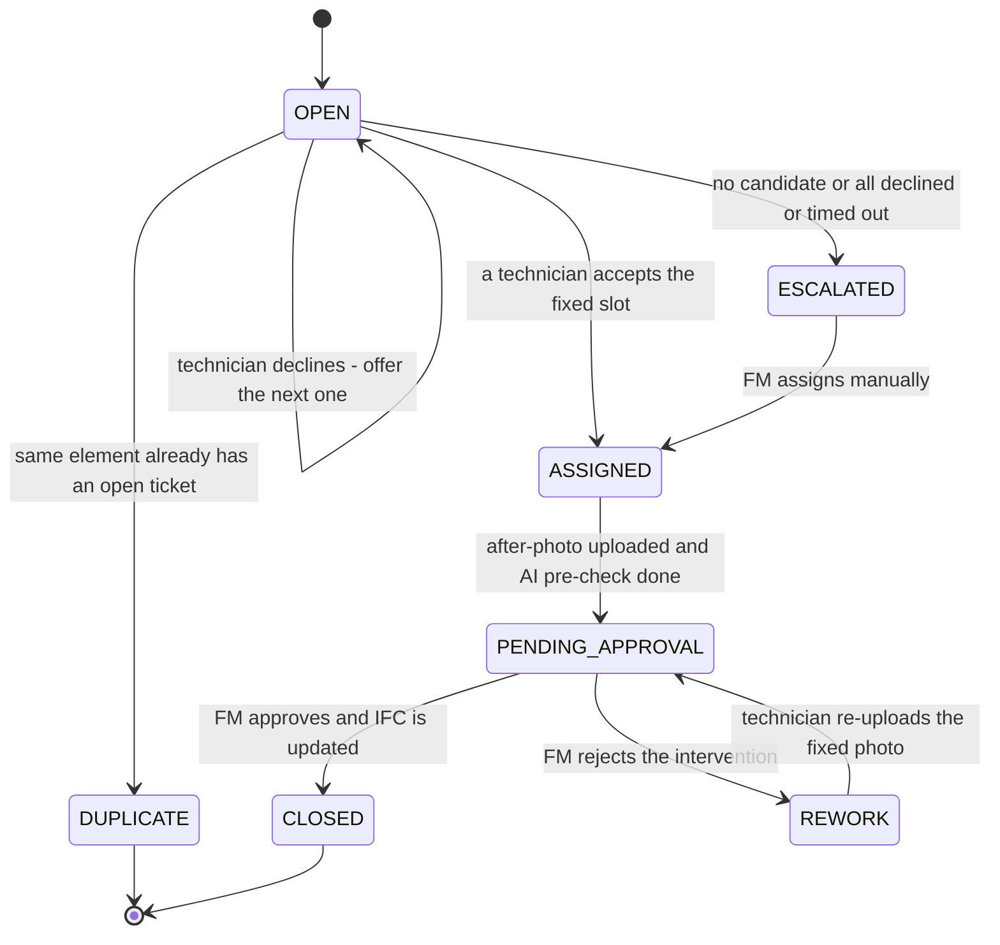
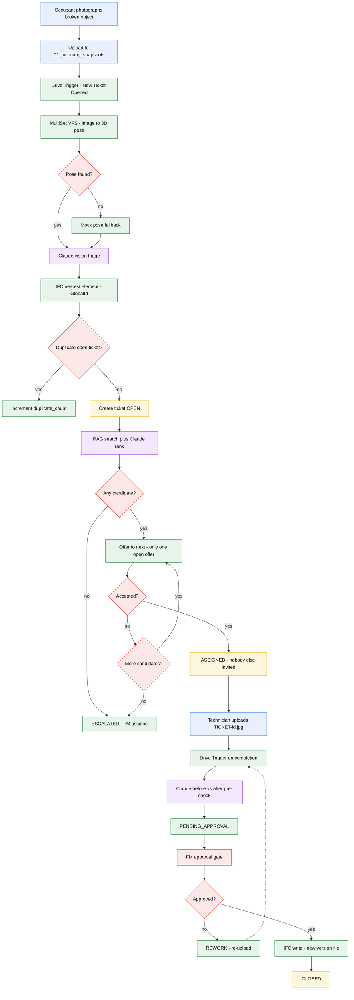
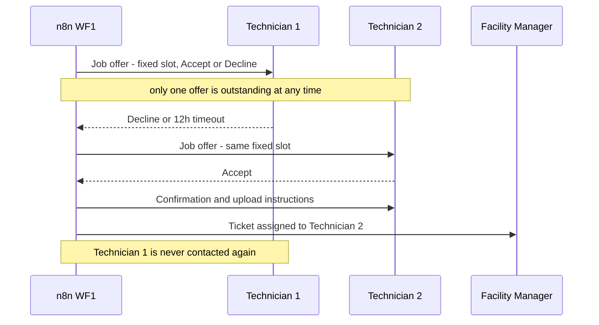

# Community-Based Maintenance (CBM) — AI-Agent Facility Ticketing
## Design Document & Implementation Guide

---

## 1. Executive Summary

This document describes the design and reference implementation of a **Community-Based Maintenance (CBM)** system: an AI-agent facility-ticketing pipeline built on **n8n**. The system lets any occupant of a building report a broken object simply by photographing it. From that single photo the system autonomously localizes the object in 3D space, triages the damage, finds and dispatches the right technician, supervises the repair, and — once the facility manager approves — writes the intervention back into the building's digital twin (an **IFC** model).

The whole flow is intentionally event-driven and is decomposed into three n8n workflows plus one supporting microservice:

- **WF0 — Technician Vector Store Loader:** turns the technician database into a semantic (RAG) index.
- **WF1 — Ticket Intake & Dispatch:** photo → localization → AI triage → IFC element match → deduplication → RAG dispatch cascade.
- **WF2 — Completion, Approval & IFC Update:** after-photo → AI before/after verification → facility-manager approval → versioned IFC write → closure.
- **IFC microservice (FastAPI + IfcOpenShell):** the only component that reads and writes the IFC model, exposed to n8n over REST.

Three hard business constraints shaped the architecture, and each is enforced **structurally** rather than by convention (see §2.2):

1. Once a technician accepts a job, **no other technician is ever invited**.
2. A technician can **only accept or decline** a system-proposed, fixed time slot — they cannot propose or change dates.
3. The **facility manager holds final closure authority**; nothing is closed and the model is not updated without an explicit approval.

Every non-trivial design decision below is accompanied by its motivation, because the brief explicitly asked for motivated suggestions rather than a bare implementation.

---

## 2. Actors, Design Principles & Constraints

### 2.1 Actors

- **Occupant / community reporter.** Any person in the building. Their only interaction is uploading a photo. No app install, no form, no account — this is the "community-based" premise: the lowest possible friction maximizes the number of issues actually reported.
- **Facility Manager (FM).** Supervises the queue, receives notifications, and is the single approval authority for closure. The FM is deliberately kept *out* of the routine dispatch loop (which is automated) but *in* the loop at the one point that carries accountability: signing off that the building record is correct.
- **Technician.** Receives job offers, accepts/declines, performs the repair, and uploads the after-photo. Technicians live in a database and are matched semantically.
- **The system (n8n + services).** Orchestrates everything else and is responsible for making the two humans' jobs as small and as high-value as possible.

### 2.2 Design principles

1. **Automate the routine, gate the accountable.** Localization, triage, matching, scheduling and dispatch are fully automated. The only mandatory human decision is the FM's final approval, because that is the step with real-world consequences (it changes the official building record).
2. **Enforce constraints by construction, not by asking politely.** Wherever a rule could be violated, the workflow topology makes the violation impossible rather than relying on a human doing the right thing.
3. **Deterministic where determinism matters; AI where judgment matters.** Dates, SLAs and state transitions are computed by ordinary code. Perception and natural-language judgment (what is broken, which technician profile fits) are delegated to the LLM. Mixing these up — e.g. asking an LLM to do date arithmetic — is a common and avoidable source of bugs.
4. **Graceful degradation.** Every external dependency (MultiSet, the IFC service, the LLM) can fail without breaking the pipeline. The system always produces a ticket and always reaches a terminal state; failures downgrade quality, they do not halt the flow.
5. **Append-only audit.** Tickets, dispatch attempts and IFC versions are never overwritten. This gives a full history for accountability and post-hoc analysis, in the spirit of ISO 19650 information management.

### 2.3 How each hard constraint is enforced

| # | Constraint | Structural enforcement |
|---|------------|------------------------|
| 1 | After acceptance, no other technician is invited | The dispatch cascade is a **sequential loop** (`splitInBatches` size 1 + a single `sendAndWait`). At any instant **exactly one** offer is outstanding. The moment an offer is accepted, the loop is exited on the "accepted" branch and never iterates again — so a second offer is physically never sent. |
| 2 | Technician can only accept/decline a fixed slot | The offer is a **two-button approval email** (`sendAndWait`, approval type *double*). There is no free-text or date field in the interaction. The slot is computed by the system beforehand and shown read-only; the technician's entire input space is {Accept, Decline}. A 12-hour non-response is treated as Decline. |
| 3 | FM has final closure authority | Closure and the IFC write sit **behind an FM `sendAndWait` approval gate**. The AI before/after check is explicitly a *pre-screen* that informs the FM; it has no authority to close. Only the "approved" branch reaches the IFC-write and `CLOSED` nodes. |

### 2.4 Assumptions

- The building is already digitalized as an IFC model. For a proof of concept a **single room with a few elements** is sufficient, and this repository ships a generator for exactly that (see §8.4).
- The "snapshot camera app" is out of scope and is **simulated with Google Drive**: uploading a file to a watched folder is the trigger, standing in for the mobile capture app. Swapping Drive for a real app later touches only the trigger node.
- Credentials for Google Drive, Gmail, Postgres/Supabase, OpenAI, Anthropic and MultiSet are assumed to exist and are wired in after import.

---

## 3. System Architecture

### 3.1 Component overview



### 3.2 Why this shape

**Why three workflows instead of one.** The natural life of a ticket has two asynchronous "wake-ups" separated by an unbounded amount of real-world time: the initial report, and the completion photo that may arrive hours or days later. Two separate trigger-driven workflows model this cleanly; trying to keep a single execution alive across the repair would be fragile. WF0 is separated because building the vector index is an occasional maintenance action, not part of the per-ticket hot path.

**Why an external IFC microservice.** IFC manipulation requires **IfcOpenShell**, a compiled C++/Python library that cannot run inside n8n's JavaScript Code nodes. Rather than contort n8n, we expose exactly the two IFC operations the pipeline needs (nearest-element lookup and maintenance-write) as a small REST service. This also isolates the one component that mutates the digital twin behind a clean, testable boundary.

**Why Postgres + pgvector (Supabase).** We need both relational state (the ticket lifecycle, technician records, the dispatch log) and vector search (semantic technician matching). Supabase gives both in one place, and n8n ships native Supabase Vector Store nodes, so we avoid standing up a second datastore.

**Why Google Drive as the intake.** The brief explicitly allows simulating the capture app with a Drive upload. A folder-watch trigger is the smallest possible stand-in and keeps the real integration point (a single trigger node) obvious for a future swap.

---

## 4. Ticket State Machine

The ticket is the backbone of the system; every workflow is really just a set of transitions on this state machine. Modelling it explicitly (a `status` column) is what makes the whole system idempotent and debuggable — at any moment the state of any ticket is a single readable value.



Notes on the modelling:

- The dispatch cascade is the `OPEN --> OPEN` self-loop: while the system is still hunting for a technician the DB status stays `OPEN`, and only the *resolution* of the cascade moves it to `ASSIGNED` or `ESCALATED`. This keeps the persisted status set small and faithful to what the workflows actually write.
- `DUPLICATE` is a terminal side-effect: a second report of an already-open fault does not create a competing ticket; it increments a counter on the existing one (see §5.2).
- `REWORK` re-enters `PENDING_APPROVAL` through the *same* completion workflow, so the rejection path reuses all the verification and approval machinery with no duplicated logic.

---

## 5. Phase-by-Phase Design (with reasoning)

### 5.1 Phase 1 — Intake & Localization

**Trigger.** A Google Drive trigger watches `01_incoming_snapshots` and fires on file-created. This is the event the brief calls "New Ticket Opened."

**MultiSet VPS localization.** MultiSet is a Visual Positioning System: given a single camera image (plus the camera intrinsics), it returns the camera's **6-DoF pose** inside a previously scanned map, with centimetre-level precision and independent of the scanning device. Two REST calls are involved:

1. **Authentication** — `POST https://api.multiset.ai/v1/m2m/token` using HTTP Basic auth (your `clientId`/`clientSecret`). It returns a **JWT valid for ~30 minutes**. In n8n this is an HTTP Request node with generic Basic-auth credentials.
2. **Query** — `POST https://api.multiset.ai/v1/vps/map/query-form`, a **multipart/form-data** request carrying the target `mapCode`, the **camera intrinsics** (`fx`, `fy`, `px`, `py`, `width`, `height`), a handedness flag, and the query image as a binary field. It returns whether a pose was found, the `position` (x, y, z), the `rotation` quaternion, a confidence value and the matched map codes.

Three practical points that the implementation bakes in:

- **Camera intrinsics are mandatory.** VPS cannot triangulate without the focal lengths and principal point of the lens that took the photo. In a real deployment these come from the capture device; the workflow exposes them as explicit form fields so they are easy to wire to real per-device values.
- **Image size cap.** The query image's largest side should be **≤ 1280 px**; larger images should be downscaled before the call.
- **Coordinate frame / handedness.** MultiSet's default map frame is left-handed, Y-up (Unity convention). Because our IFC world is right-handed and Z-up, the request sets `isRightHanded=true` and the IFC service applies an explicit map→IFC registration (see §8.3). This frame alignment is the single most important thing to get right when moving from the PoC to a real scanned map.

**Graceful degradation.** Both MultiSet nodes are set to *On Error → Continue*. If MultiSet is not yet configured (no `mapCode`) or is unreachable, the `Normalize Pose` code node falls back to a **mock pose of (2.5, 1.0, 1.2)** — the exact coordinates of `Door_101` in the shipped sample model — so the entire pipeline runs end-to-end on day one, before any real map exists. The ticket records `localization_source = mock_fallback` so this is always visible and auditable.

### 5.2 Phase 2 — AI Triage, IFC Match & Deduplication

**Vision triage (Claude).** The snapshot is sent to Claude with a strict instruction to return **only** a small JSON object: `object_type`, `damage_description`, `severity` (low/medium/high/critical), `required_trade`, and a `safety_risk` boolean. Using vision here means the occupant needs to supply *nothing but the photo* — the model infers the rest. A dedicated Code node parses the JSON **defensively**: if the model ever returns malformed output, the ticket degrades to a `manual review` item instead of crashing the run.

**Why the object→IFC-class hint.** The parsed `object_type` is mapped to a candidate IFC class (`door → IfcDoor`, `light → IfcLightFixture`, …). This hint is passed to the IFC service so the spatial search can prefer elements of the right type, which disambiguates when several elements sit close together. It is only a *hint*: if the hinted class yields nothing, the service retries class-agnostically (§8.2).

**IFC element match.** The pose (x, y, z) is sent to the IFC microservice's `/elements/nearest`, which returns the **GlobalId** of the closest maintainable element. That GlobalId is the stable identifier that ties the ticket to a specific physical asset for its whole life, including the eventual model update.

**Deduplication as a community signal.** Before creating a ticket, the workflow checks whether an **open** ticket already exists for the same `ifc_global_id`. If so, it does **not** open a second ticket; it increments `duplicate_count` on the existing one. This is a deliberate feature, not just noise-suppression: in a community setting the same broken thing will be reported by many people, and the number of reports is a useful **priority/impact signal** rather than a reason to spawn duplicate work orders.

**Ticket creation.** Non-duplicates are inserted with status `OPEN` and the full triage + localization payload, and the DB returns the new row (including its `id`) for the downstream steps.

### 5.3 Phase 3 — RAG Dispatch Cascade

**Why RAG for technician matching.** A rigid `WHERE trade = ...` query is brittle: it cannot express "this person is nominally a carpenter but is the building's known door-hardware specialist," and it forces the taxonomy to be perfect up front. Instead, WF0 turns each technician row into a **natural-language profile** and embeds it; at dispatch time the job description is embedded and used for **semantic search** (Supabase vector store, OpenAI `text-embedding-3-small`, 1536 dims). This retrieves plausibly-relevant people even when the wording does not match exactly.

**Why a re-rank by Claude on top of vector search.** Vector similarity is fuzzy and returns a *neighbourhood*, not a decision. Claude re-ranks the retrieved candidates against the concrete job (trade match, severity, the specifics of the damage), returns **at most three**, best first, and is instructed to **exclude** inactive technicians and trade mismatches. This two-stage "retrieve then reason" pattern is more robust than either stage alone.

**Why scheduling is deterministic (not LLM).** The proposed time slot is computed in a Code node from an explicit **SLA policy**: critical → +4 hours; high → next business day 09:00; medium → +3 business days; low → +7 business days, all in Europe/Rome. Date arithmetic and business-day skipping must be exact and reproducible, so they are ordinary code. (Delegating this to an LLM would be both unreliable and untestable.)

**The cascade itself — and how it enforces constraints 1 and 2.** The ranked candidates become a queue consumed one at a time:

- `splitInBatches` (size 1) hands out exactly one candidate per iteration.
- A single Gmail `sendAndWait` sends that one technician a **two-button** offer (Accept / Decline) showing the fixed slot, and pauses the workflow.
- **Accept** → the ticket is set to `ASSIGNED`, the technician gets a confirmation (with instructions to upload `TICKET-<id>.jpg` when done), the FM is notified, and the loop is **exited** — so no further offers are ever sent (**constraint 1**).
- **Decline / 12-hour timeout** → the attempt is logged and the loop advances to the next candidate.
- Queue exhausted (everyone declined) or no candidates at all → the ticket becomes `ESCALATED` and the FM is asked to assign manually.

Because there is only ever **one** outstanding offer, the "first acceptance wins and locks out everyone else" rule is automatic, and because the interaction is two buttons over a system-set slot, the technician cannot alter the date (**constraint 2**).

### 5.4 Phase 4 — Completion, Approval & IFC Update

**Completion trigger and ticket linking.** A second Drive trigger watches `02_completed_snapshots`. The technician names the after-photo `TICKET-<id>.jpg`; a Code node extracts the id by regex and looks the ticket up. Anything that does not map to a valid, non-closed ticket raises an **FM alert** rather than failing silently — there are no dead ends.

**AI before/after verification (a pre-screen, not a decision).** The system re-fetches the original before-photo from the ticket, downloads the new after-photo, merges the two binaries into one item, and asks Claude to compare them and return `repair_verified` + a confidence + a one-line observation. This is explicitly framed — in the code, in the emails, and here — as a **pre-screen that informs the FM**. It has no authority to close the ticket, precisely so that **constraint 3** is never diluted.

**The FM approval gate.** The ticket moves to `PENDING_APPROVAL` and the FM receives a two-button `sendAndWait` email carrying the AI verdict and links to both photos, with a 72-hour window. Only the **Approve** branch proceeds to update the model and close the ticket; **Reject** moves the ticket to `REWORK` and asks the technician to redo the work and re-upload under the same filename (which re-triggers this very workflow).

**The IFC write and closure.** On approval, the workflow calls the IFC service to write a maintenance record onto the element's GlobalId and produce a **new versioned model file** (§8). The ticket is then set to `CLOSED`, the technician's completed-jobs counter is bumped, and both the technician and the FM are notified. If the IFC service happens to be down at this moment, the closure still proceeds and records `ifc_version = IFC_SYNC_FAILED`, so the ticket is not blocked and the model can be re-synced later — the digital-twin update is important but must not hold a real-world work order hostage.

---

## 6. End-to-End Scenarios

The design was validated against nine scenarios that together exercise every branch:

- **S1 — Happy path.** Photo → pose found → triage → element matched → not a duplicate → top candidate accepts → repair → after-photo → AI verified → FM approves → IFC v2 written → CLOSED.
- **S2 — First technician declines.** Candidate 1 declines; the cascade offers candidate 2, who accepts. Candidate 1 receives nothing further. Demonstrates constraint 1.
- **S3 — Everyone declines / times out.** All ranked candidates decline or ignore the 12-hour window; ticket → ESCALATED; FM asked to assign manually.
- **S4 — No candidates at all.** Vector search + re-rank return an empty set (e.g. an exotic trade with nobody active); ticket → ESCALATED immediately, skipping the cascade.
- **S5 — Duplicate report.** A second occupant photographs the same already-open broken door; no new ticket, `duplicate_count` incremented on the existing one.
- **S6 — Localization failure.** MultiSet unreachable or not configured; `Normalize Pose` uses the mock pose; ticket still created with `localization_source = mock_fallback`; flow continues normally.
- **S7 — FM rejects the repair.** After-photo verified by AI but the FM is not satisfied; ticket → REWORK; technician redoes and re-uploads under the same filename; WF2 re-runs and returns to PENDING_APPROVAL.
- **S8 — Unmatched completion photo.** A file with a wrong or missing `TICKET-<id>` name lands in the completed folder; FM receives an "unmatched photo" alert; no ticket is corrupted.
- **S9 — Critical severity.** Triage returns `critical`; the SLA sets a +4-hour slot; the FM notification flags `safety_risk = true`; the same cascade runs against the shortened deadline.

---

## 7. Master Flow & Dispatch Sequence

### 7.1 Master flowchart

The complete end-to-end flow (all four phases, colour-coded by role — human action, AI reasoning, system-deterministic, data store, human gate) is provided as a standalone file, **`master_workflow.mermaid`**, and is reproduced here:



### 7.2 Dispatch cascade sequence (constraint 1 in action)



---

## 8. IFC / Digital-Twin Update Strategy

### 8.1 Why IfcOpenShell behind a microservice

**IfcOpenShell** is the de-facto open-source toolkit for reading and writing IFC. It is a compiled library with a Python API, so it cannot run inside n8n. Wrapping it in a small **FastAPI** service gives n8n plain REST endpoints and keeps the one component that mutates the digital twin isolated and independently testable. Alternative BIM stacks were considered and are noted for completeness: **BIMserver** (a full model server with revision control, heavier than needed here), **xBIM** (an excellent toolkit but .NET-centric), and **Bonsai / BlenderBIM** (which is itself built on IfcOpenShell and is ideal for *visually* inspecting the resulting files). For a headless read/write service, IfcOpenShell alone is the leanest fit.

### 8.2 The two endpoints the pipeline needs

- **`POST /elements/nearest`** — input a pose `(x, y, z)` plus an optional `ifc_class` hint; the service transforms the pose into the IFC frame, computes each maintainable element's world position from its `ObjectPlacement`, and returns the nearest one's GlobalId and distance. If the class hint matches nothing it retries class-agnostically, and it rejects matches beyond a sanity distance so a wildly wrong pose returns "not found" rather than a nonsensical element.
- **`POST /elements/{global_id}/maintenance`** — writes the maintenance record onto that element and versions the model (below).

Two read endpoints (`GET /elements`, `GET /elements/{global_id}`) and a `GET /health` round out the service for debugging.

### 8.3 Coordinate registration (map frame → IFC frame)

The pose from MultiSet lives in the scanned-map frame; the IFC model lives in its own project frame. The service supports:

- **`AXIS_MODE`** — an axis convention switch (`identity`, or `y_up_to_z_up` to convert a right-handed Y-up map frame to IFC's Z-up).
- **`MULTISET_TO_IFC_MATRIX`** — an optional full 4×4 rigid transform (rotation + translation) obtained from a **one-off calibration**: measure at least three points whose coordinates are known in *both* frames and solve for the transform. For the PoC the sample model is authored directly in "map" coordinates, so the default is the identity and no calibration is needed.

This is the crucial bridge to get right when replacing the mock pose with a real scanned map; it is deliberately isolated in one function so calibration is a configuration change, not a code change.

### 8.4 The maintenance property set and versioning

Each intervention is written as a **custom property set `CBM_MaintenanceLog`** attached to the element, holding the last ticket id, date, technician, description, condition status, who approved it, and a JSON `History` array that **accumulates every past intervention**. Storing this inside the IFC (rather than only in the database) means the digital twin itself carries its maintenance history and remains meaningful when opened in any IFC viewer — this is the same intent as the **COBie** facility-handover schema, expressed with a purpose-built Pset.

Crucially, the service **never overwrites** the model: each write is saved as a new file `room_v{N+1}.ifc`, an `active_model.txt` pointer is advanced, and a line is appended to `maintenance_audit.jsonl`. This append-only, versioned approach mirrors ISO 19650 information-management practice and means the complete history of the twin is reconstructable and auditable.

### 8.5 Verified behaviour

The nearest-element lookup and the Pset write were exercised end-to-end against the generated sample model: the mock pose `(2.5, 1.0, 1.2)` resolves to `Door_101` at distance 0, a maintenance record is written, the model is saved as `room_v2.ifc`, and re-opening that file confirms the `CBM_MaintenanceLog` persisted with its history entry. A subtle but important bug was caught and fixed during this check — the sample generator originally emitted **millimetre** units (IfcOpenShell's default), which silently scaled the door to `(2500, 1000, 1200)` and broke the metre-based pose match; the generator now assigns explicit metre units so the whole system is consistently in metres, matching MultiSet's output.

---

## 9. MultiSet ↔ n8n: REST vs MCP

The brief asked whether connecting MultiSet to n8n needs **MCP** (Model Context Protocol). Both are viable and n8n supports MCP natively — it ships an **MCP Client Tool** sub-node, an **MCP Client** node, and an **MCP Server Trigger** — so n8n can act as an MCP client *or* expose its own tools as an MCP server.

**Recommendation for this pipeline: use MultiSet's REST API directly.** The reasoning:

- MultiSet exposes a **plain, documented REST API** (token + query). Calling it with two HTTP Request nodes is the most direct, transparent and debuggable option, with no extra moving parts.
- MCP shines when an **autonomous LLM agent** decides *which* tool to call at runtime. Our localization step is a **fixed, deterministic pipeline stage** — it runs on every ticket in the same way — so there is no agentic decision for MCP to add value to here.
- Fewer layers means fewer failure modes and easier graceful degradation (the `On Error → Continue` fallback is trivial on an HTTP node).

**When MCP would become the right choice.** If the system later grows an interactive "facility copilot" — an agent that a manager can converse with ("where was the last plumbing issue, and is anyone free to look at it?") and that chooses among many tools (localization, ticket queries, scheduling) on the fly — then wrapping these capabilities as MCP tools is exactly the right abstraction. In that case one would stand up an MCP server exposing `localize_image`, `query_tickets`, `dispatch_job`, etc., and let n8n's MCP Client Tool feed them to the agent. The clean way to evolve is: keep the deterministic REST pipeline as the system of record, and add an MCP layer *on top* for the conversational/agentic surface, rather than replacing the pipeline.

---

## 10. Improvements Beyond the Brief (each motivated)

Every item here is implemented in the reference workflows; each solves a concrete failure mode.

1. **Deduplication as a community signal (§5.2).** *Motivation:* in a community setting the same fault is reported many times; treating repeats as a `duplicate_count` on one ticket both prevents redundant work orders and turns crowd reports into a priority signal.
2. **Deterministic SLA scheduling (§5.3).** *Motivation:* response deadlines are a policy that must be exact and reproducible; encoding them in code (not the LLM) makes them testable and trustworthy, and ties the proposed slot directly to severity.
3. **Two-stage RAG (vector retrieve + Claude re-rank) (§5.3).** *Motivation:* vector search alone is fuzzy and rigid trade-filters alone are brittle; combining semantic recall with LLM judgment gives both flexibility and correctness, with a hard cap of three offers.
4. **AI before/after pre-verification (§5.4).** *Motivation:* it saves the FM from reviewing obviously-incomplete work while never removing their authority — the verdict is advisory, the human still decides.
5. **Graceful degradation everywhere (§5.1, §5.4).** *Motivation:* a facility tool that stalls when one API is down is unusable; every external call can fail without halting the ticket, downgrading quality instead of availability.
6. **Escalation paths (§5.3).** *Motivation:* automation must fail into a human, not into a void; "no candidates" and "everyone declined" both route to the FM with context.
7. **Append-only audit trails — `dispatch_log`, versioned IFC, `maintenance_audit.jsonl` (§5.3, §8.4).** *Motivation:* accountability and debugging require history; who was offered what and when, and every change to the twin, are all recoverable.
8. **Technician feedback loop (`jobs_completed`, and a `rating` field ready for use).** *Motivation:* dispatch quality should improve over time; capturing completion counts and ratings feeds future prioritisation.
9. **Security hardening (design-level).** *Motivation:* the system emails action links and builds SQL from external input. The reference implementation escapes single quotes on every LLM/user-derived string before it reaches SQL; a production build should go further with **parameterised queries** end-to-end, **signed/expiring approval links** so an offer email cannot be replayed or forged, and explicit handling of the **PII** (names, emails, photos of premises) that flows through the pipeline. These are called out honestly as the main gaps between a PoC and production.

---

## 11. Implementation Appendix

### 11.1 Repository layout

```
cbm/
  n8n_wf0_technician_vector_loader.json      # WF0 - build the RAG index
  n8n_wf1_ticket_intake_and_dispatch.json    # WF1 - intake -> dispatch
  n8n_wf2_completion_approval_ifc_update.json# WF2 - completion -> IFC -> close
  ifc_service.py                             # FastAPI + IfcOpenShell microservice
  create_sample_ifc.py                       # generates the sample room model
  master_workflow.mermaid                    # end-to-end diagram
  design_document.md                         # this document
  models/                                    # created at runtime
    room_v1.ifc                              # initial model
    active_model.txt                         # pointer to the current version
    maintenance_audit.jsonl                  # append-only change log
```

### 11.2 Database schema (Postgres + pgvector)

```sql
-- Enable pgvector (Supabase: already available; otherwise: CREATE EXTENSION).
CREATE EXTENSION IF NOT EXISTS vector;

-- Core ticket lifecycle table.
CREATE TABLE tickets (
    id                    BIGSERIAL PRIMARY KEY,
    status                TEXT NOT NULL DEFAULT 'OPEN',   -- OPEN, ASSIGNED, ESCALATED,
                                                          -- PENDING_APPROVAL, REWORK, CLOSED
    drive_file_id         TEXT,          -- before-photo (Drive)
    photo_url             TEXT,
    after_file_id         TEXT,          -- after-photo (Drive)
    pos_x                 DOUBLE PRECISION,
    pos_y                 DOUBLE PRECISION,
    pos_z                 DOUBLE PRECISION,
    localization_source   TEXT,          -- 'multiset' | 'mock_fallback'
    ifc_global_id         TEXT,          -- matched element, or 'UNMAPPED'
    ifc_element_name      TEXT,
    object_type           TEXT,
    damage_description    TEXT,
    severity              TEXT,          -- low | medium | high | critical
    required_trade        TEXT,
    safety_risk           BOOLEAN DEFAULT FALSE,
    duplicate_count       INTEGER DEFAULT 0,
    technician_id         TEXT,
    technician_name       TEXT,
    technician_email      TEXT,
    scheduled_at          TIMESTAMPTZ,
    verification          JSONB,         -- AI before/after verdict
    ifc_version           TEXT,          -- e.g. 'room_v2.ifc' or 'IFC_SYNC_FAILED'
    created_at            TIMESTAMPTZ DEFAULT NOW(),
    closed_at             TIMESTAMPTZ
);

-- Technician master data.
CREATE TABLE technicians (
    id               TEXT PRIMARY KEY,
    name             TEXT NOT NULL,
    email            TEXT NOT NULL,
    trades           TEXT[] NOT NULL,     -- e.g. {carpenter, glazier}
    zone             TEXT,
    rating           NUMERIC(2,1) DEFAULT 5.0,
    jobs_completed   INTEGER DEFAULT 0,
    active           BOOLEAN DEFAULT TRUE
);

-- Every dispatch attempt (append-only audit).
CREATE TABLE dispatch_log (
    id             BIGSERIAL PRIMARY KEY,
    ticket_id      BIGINT REFERENCES tickets(id),
    technician_id  TEXT,
    response       TEXT,               -- 'declined_or_timeout', etc.
    created_at     TIMESTAMPTZ DEFAULT NOW()
);

-- Vector store for RAG technician matching (LangChain/Supabase convention).
CREATE TABLE technicians_documents (
    id         BIGSERIAL PRIMARY KEY,
    content    TEXT,                   -- the embedded technician profile text
    metadata   JSONB,                  -- tech_id, name, email, trades, zone, rating, active
    embedding  VECTOR(1536)            -- text-embedding-3-small dimensionality
);

-- Similarity search function expected by the Supabase Vector Store node.
CREATE OR REPLACE FUNCTION match_documents (
    query_embedding VECTOR(1536),
    match_count     INT DEFAULT NULL,
    filter          JSONB DEFAULT '{}'
) RETURNS TABLE (
    id       BIGINT,
    content  TEXT,
    metadata JSONB,
    similarity FLOAT
) LANGUAGE plpgsql AS $$
BEGIN
    RETURN QUERY
    SELECT t.id, t.content, t.metadata,
           1 - (t.embedding <=> query_embedding) AS similarity
    FROM technicians_documents t
    WHERE t.metadata @> filter
    ORDER BY t.embedding <=> query_embedding
    LIMIT match_count;
END;
$$;
```

Seed example (note the deliberately imperfect-taxonomy case for RAG to handle):

```sql
INSERT INTO technicians (id, name, email, trades, zone, rating, jobs_completed, active) VALUES
  ('tech-01', 'Marco Bianchi',  'marco.bianchi@example.com',  '{carpenter,glazier}',      'Building A', 4.8, 37, TRUE),
  ('tech-02', 'Giulia Rossi',   'giulia.rossi@example.com',   '{electrician}',            'Building A', 4.6, 52, TRUE),
  ('tech-03', 'Ahmed Hassan',   'ahmed.hassan@example.com',   '{plumber,hvac_technician}','Building A', 4.9, 61, TRUE),
  ('tech-04', 'Sara Conti',     'sara.conti@example.com',     '{generalist}',             'Building A', 4.3, 20, TRUE),
  ('tech-05', 'Luca Verdi',     'luca.verdi@example.com',     '{electrician}',            'Building B', 4.7, 44, FALSE);
```

### 11.3 Environment variables (IFC service)

| Variable | Default | Purpose |
|----------|---------|---------|
| `IFC_MODEL_DIR` | `./models` | Directory holding the versioned IFC files and pointers |
| `AXIS_MODE` | `identity` | `identity` or `y_up_to_z_up` axis convention for the map→IFC transform |
| `MULTISET_TO_IFC_MATRIX` | identity | JSON 4×4 rigid transform from a real map↔IFC calibration |

### 11.4 Setup steps

1. **Create the schema** (§11.2) in Supabase/Postgres and seed the `technicians` table.
2. **Generate the sample model:** `pip install "ifcopenshell>=0.8" numpy fastapi uvicorn pydantic` then `python create_sample_ifc.py` (writes `models/room_v1.ifc`).
3. **Start the IFC service:** `uvicorn ifc_service:app --host 0.0.0.0 --port 8000` and confirm `GET /health` lists three maintainable elements.
4. **Import the three workflow JSONs** into n8n.
5. **Wire credentials** on every node: Google Drive OAuth2, Gmail OAuth2, Postgres (Supabase), Supabase API, OpenAI (embeddings), Anthropic, and MultiSet Basic-auth.
6. **Replace placeholders:** the two Drive folder IDs (`REPLACE_WITH_INCOMING_FOLDER_ID`, `REPLACE_WITH_COMPLETED_FOLDER_ID`), the `REPLACE_WITH_MULTISET_MAP_CODE`, the completed-folder link in the confirmation email, and the FM address (`facility.manager@example.com`). If the IFC service is not reachable at `http://ifc-service:8000`, update its URL in the HTTP nodes.
7. **Set real camera intrinsics** in the MultiSet VPS Query node (or leave them and rely on the mock-pose fallback for a first dry run).
8. **Run WF0 once** to populate `technicians_documents`.
9. **Verify the two wait windows** after import: the offer `sendAndWait` should show *Limit Wait Time = 12 hours* and the FM-approval `sendAndWait` *= 72 hours* (n8n occasionally needs these re-confirmed post-import).

### 11.5 Simulating a full run

1. Upload any photo to `01_incoming_snapshots`. Within a minute WF1 fires, MultiSet is attempted (or the mock pose is used), Claude triages, the element is matched to `Door_101`, a ticket is created, the FM is emailed, and the best technician receives an Accept/Decline offer.
2. Click **Accept** in that email. The ticket flips to `ASSIGNED`, the technician gets a confirmation telling them to upload `TICKET-<id>.jpg`, and the FM is told who took the job.
3. Upload a second photo named exactly `TICKET-<id>.jpg` (that ticket's id) to `02_completed_snapshots`. WF2 fires, Claude compares before/after, the ticket becomes `PENDING_APPROVAL`, and the FM receives the approval email.
4. Click **Approve and close**. The IFC service writes `CBM_MaintenanceLog` onto `Door_101`, saves `room_v2.ifc`, advances `active_model.txt`, the ticket closes, and both parties are notified. Inspect `models/room_v2.ifc` (e.g. in Bonsai/BlenderBIM) to see the maintenance history on the door.

### 11.6 Known limitations (honest list)

- **Localization realism.** The mock-pose fallback makes the PoC runnable, but real accuracy depends entirely on a properly scanned MultiSet map, correct per-device camera intrinsics, and a good map↔IFC calibration (§8.3).
- **SQL construction.** For clarity the workflows build SQL by expression with single-quote escaping; a production system should use fully parameterised queries.
- **Approval link security.** `sendAndWait` links should be signed/expiring in production so offers cannot be replayed or forged.
- **Concurrency.** The duplicate check is check-then-insert; under heavy simultaneous load it should be backed by a DB unique constraint / upsert to be fully race-free.
- **Single-building sample.** The shipped model is one room; scaling to a real multi-storey model is a data exercise (the code is class- and element-agnostic) but should be tested with a realistically sized IFC.
- **PII / data protection.** Names, emails and photographs of premises flow through the system; a production deployment needs a retention and access-control policy for this data.
