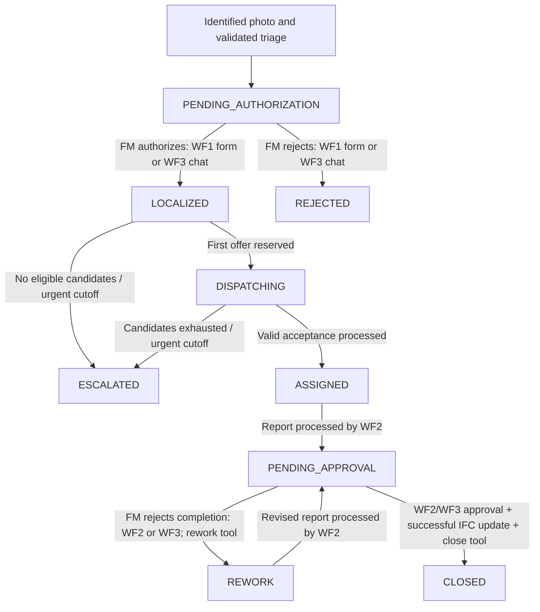

# Ticket states and transitions — current CBM demo

Updated on 18 September 2026 for shared WF2 email/WF3 chat completion approval. The current application has the 15 existing project workflows plus two action helpers; the approval-email helper is now shared with WF2. The ticket-state rules below follow the saved n8n workflows and the functions/triggers in the running `cbm_demo` PostgreSQL database.

The authoritative ticket state is **`public.tickets.status`**. The current automatic lifecycle writes **9 distinct states**. Four additional names remain as a schema default, compatibility values or assessment vocabulary; they are documented separately below.

## 1. Main transition table

Each row identifies the resulting state, the state immediately before it, the action and the actual writer. In the dispatch helpers, a JavaScript function proposes a new state; **Commit Change** writes it to PostgreSQL. Reading context or receiving an email response alone does not perform that commit.

| Resulting ticket state | Meaning | From | Action that causes the transition | Workflow, node/tool and function that writes it |
|---|---|---|---|---|
| **PENDING_AUTHORIZATION** | Asset/issue identified; waiting for FM permission to begin maintenance | No ticket yet | A photo passes identification and triage, and no existing ticket is reused | **WF1 → Submit Ticket for FM Authorization** → `cbm_capture_identified()` → `cbm_create_ticket()` → insert trigger `cbm_guard_dispatch_authorization()` |
| **LOCALIZED** | Identified and authorized; ready for automatic dispatch | `PENDING_AUTHORIZATION` | FM approves the intervention from the WF1 authorization form **or explicitly asks the authenticated WF3 chat agent to approve it** | **WF1 → Persist Intervention Authorization**, or **WF3 → `approve_intervention` → Guarded FM Ticket Action → Begin Guarded Action**; both use `cbm_authorize_dispatch()`. WF3's `cbm_wf3_begin_action()` validates and records the chat request before reusing that function |
| **REJECTED** | FM refused the proposed intervention before dispatch | `PENDING_AUTHORIZATION` | FM rejects the intervention from the WF1 authorization form **or explicitly asks the authenticated WF3 chat agent to reject it and supplies a reason** | **WF1 → Persist Intervention Authorization**, or **WF3 → `reject_intervention` → Guarded FM Ticket Action → Begin Guarded Action**; both use `cbm_authorize_dispatch()`. The WF3 wrapper records actor, source, reason and request key |
| **DISPATCHING** | Technician offer process has started; no winner assigned yet | `LOCALIZED` | Dispatch Agent reserves the first eligible technician offer | **WF1 → send_offer** → **Dispatch - Send Technician Offer** → **Reserve Technician Offer** (`offer()`) → **Commit Change** SQL |
| **ASSIGNED** | A technician has won and is responsible for the intervention | `DISPATCHING` | A valid, timely acceptance is processed and the technician is still eligible | **WF1 → process_events** → **Dispatch - Process Responses** → **Apply Responses and Expiry** (`processEvents()`) → **Commit Change** SQL |
| **ESCALATED** | Automatic dispatch could not assign; FM intervention is required | `LOCALIZED` or `DISPATCHING` | No pending response/expiry remains and no active offer remains; eligible candidates are exhausted or the urgent appointment has been reached | **WF1 → escalate** → **Dispatch - Escalate Ticket** → **Prepare Escalation** (`escalate()`) → **Commit Change** SQL |
| **PENDING_APPROVAL** | Completion evidence has been recorded; awaiting the FM decision/closure processing | `ASSIGNED` or `REWORK`; also accepts legacy `WORK_DONE` | WF2 processes the completion PDF and reaches the point where it stores the assessment and creates a new approval cycle | **WF2 → Set Pending Approval** → direct `UPDATE tickets` SQL; also writes report/evidence, creates `approval_id` and clears `ifc_new_version` |
| **REWORK** | FM refused the completed work; the technician must correct it | `PENDING_APPROVAL` | FM rejects completion from the WF2 approval request **or explicitly asks WF3 to request rework and supplies a reason** | Shared email form or WF3 **`request_rework` → Guarded FM Ticket Action → Begin Guarded Action → Reuse Rework Transition**. Persists `CBM_WF2_APPROVAL=REJECTED` for the current `approval_id` before the guarded `UPDATE tickets`; reuses the technician-notification helper. WF2 polls this result; its **Closure Supervisor → reopen_for_rework** can finish a recorded incomplete action |
| **CLOSED** | FM approved completion and a successful IFC update/version has been recorded | `PENDING_APPROVAL` | FM approves completion from WF2 **or explicitly asks WF3 to approve completion**; the current approval is persisted, the existing IFC helper succeeds, and the guarded close function runs | WF2: **Closure Supervisor → close_ticket**. WF3: **`approve_completion` → Guarded FM Ticket Action → Reuse Guarded IFC Write → Close with Existing IFC Guard**. Both call `cbm_wf2_close_ticket()`; database trigger `cbm_wf2_guard_closed()` independently enforces current approval and matching successful IFC proof |

### Important timing details

1. **Creation:** `cbm_create_ticket()` contains an insert value of `LOCALIZED`, but the BEFORE INSERT authorization trigger changes it to `PENDING_AUTHORIZATION`. A normal new ticket is therefore first stored as `PENDING_AUTHORIZATION`; it does not first spend time in `RECEIVED` or `LOCALIZED`.
2. **First offer:** `DISPATCHING` is committed when the offer is reserved, before Gmail sends it. An email-send error does not undo that ticket-state transition.
3. **Acceptance:** **Record Offer Response** calls `cbm_record_offer_response()` to store a `CBM_RESPONSE` event. The later response-processing helper commits `ASSIGNED`. Opening a GET link is not acceptance; submitting the POST records the decision.
4. **Completion approval:** WF2's normal email links to the shared confirmation form. Both the form and WF3 chat call **Guarded FM Ticket Action → Begin Guarded Action**, which writes `CBM_WF2_APPROVAL` for the current `approval_id`; that decision alone does not change `tickets.status`. The guarded rework/closure operation performs the transition afterwards. **WF2 → Read FM Review State** calls `cbm_wf2_review_status()` once per minute while waiting; a settled action bypasses its Closure Supervisor.
5. **Rework:** there is no automatic `CLOSED → REWORK` transition. `reopen_for_rework` only accepts the current `PENDING_APPROVAL` cycle with a stored rejection.
6. **Escalation:** no automatic transition out of `ESCALATED` is implemented in these workflows. It is an unresolved job requiring operator/FM intervention, not a completed intervention.
7. **Closure:** neither WF2 nor WF3 can set `CLOSED` after a failed, skipped or unrecorded IFC update. The stored `ifc_new_version` must match a current-cycle `CBM_WF2_IFC_RESULT` with `outcome=SUCCEEDED`. `CLOSED` is still not the same as the whole closure workflow being settled: the final outcome also requires current-cycle statistics and FM/technician Gmail receipts.
8. **WF3 action scope:** WF3 can perform only the five named actions documented below. It has no tool that writes `DISPATCHING` or `ESCALATED`; those states remain controlled by WF1 dispatch logic.

## 2. Lifecycle diagram



The escalation arrows also require all pending responses/expiries to be processed and no active offers. IFC errors keep the ticket in `PENDING_APPROVAL`.

## 3. Other state names retained in the implementation

These are not additional steps that every ticket passes through.

| State name | Meaning / origin | Current implementation and responsible location |
|---|---|---|
| **RECEIVED** | Original “ticket received” state; SQL default in `schema.sql` | No current workflow creates a normal ticket in this state. A direct insert omitting `status` could use the database default. New photo sessions are stored separately as intake reports. |
| **NEEDS_TRIAGE** | Issue requires another diagnosis/triage | No current node writes this value to `tickets.status`. **WF2 → Assess Completion (Report)** can recommend it in `recommended_status`; **Parse Completion Assessment** accepts the recommendation. **Set Pending Approval** still writes `PENDING_APPROVAL` for FM review. |
| **WORK_DONE** | Older “technician says work is complete” state | No current workflow writes it. **WF2 → Ticket Open and Assigned?** and **Set Pending Approval** accept existing `WORK_DONE` tickets, allowing `WORK_DONE → PENDING_APPROVAL`. The new portal does not set it. |
| **DUPLICATE** | Older marker for a redundant ticket | Recognized by filters, but no current automatic duplicate-detection path writes it. **WF1 → Submit Ticket for FM Authorization** reuses the existing ticket via `cbm_capture_identified()` / `cbm_create_ticket()`, preserving its state and recording duplicate-related evidence/notification. |

The database column is currently `TEXT`, without an enum or an allowed-values CHECK constraint. This table inventories the implemented application states; the database does not itself prevent every arbitrary string that an external SQL writer might attempt to store. Separate authorization and closure triggers enforce their specific rules.

## 4. Actions that leave the ticket state unchanged

These actions matter to the full process even though they are not ticket-state transitions.

| Action | Ticket state effect | Where the action is recorded/handled |
|---|---|---|
| Photo upload, normalization, MultiSet failure, unclear vision, replacement request | Usually no ticket exists yet. An intake-report state changes instead | **WF1 → Claim Capture Attempt / Record Capture Failure** → `cbm_capture_begin()` / `cbm_capture_failed()` |
| Repeated source file or another report for an already-open IFC asset | Reuses existing ticket; preserves its state | **WF1 → Submit Ticket for FM Authorization** → `cbm_capture_identified()` / `cbm_create_ticket()` |
| Expired first FM authorization link | Remains `PENDING_AUTHORIZATION`; recovery renews the link | **WF1 → Recover Intake State** → `cbm_intake_recover()` |
| WF3 resends the initial intervention-authorization email | Remains `PENDING_AUTHORIZATION`; the request is queued, not reported as sent | **WF3 → `resend_approval_email` → Completion Approval Email → Guarded FM Ticket Action** → `cbm_wf3_begin_action()` queues an `AUTHORIZATION` item in the existing `cbm_intake_outbox`; WF1 notification recovery sends and records it |
| Dispatch claim/context read/initialization/opening notice | Does not itself change `LOCALIZED` to `DISPATCHING` | **Claim One Dispatch Ticket**, **Read Dispatch Memory**, **get_context**, **initialize_dispatch**, **send_notice** and called helpers |
| Technician declines or an offer expires | Remains `DISPATCHING` while further dispatch work is possible | **Dispatch - Process Responses → Apply Responses and Expiry → Commit Change** updates offer/audit data; escalation, if later required, is a separate action |
| Technician submits the web form and PDF is uploaded | Remains `ASSIGNED` or `REWORK` until WF2 reaches **Set Pending Approval** | **Technician Report Portal → Claim Report Upload / Record Report Upload** → `cbm_claim_technician_report()` / `cbm_record_technician_report()` |
| AI recommends `REWORK` or `NEEDS_TRIAGE` | Recommendation alone does not set either ticket state | **WF2 → Assess Completion (Report) / Parse Completion Assessment → Set Pending Approval** |
| Completion approval expires without an explicit FM decision | Remains `PENDING_APPROVAL` | **WF2 → Read FM Review State → Send FM Approval Request → shared helper Claim WF2 Review Email** calls `cbm_wf2_prepare_review_email()`, records `CBM_WF2_APPROVAL_EXPIRED` and claims a renewed 72-hour request; no automatic approval/rejection |
| FM approves completion in WF2 or WF3 | Remains `PENDING_APPROVAL` until the existing IFC helper records success and guarded closure succeeds | **WF2 → Persist FM Decision**, or **WF3 → `approve_completion` → Begin Guarded Action**, inserts the current `CBM_WF2_APPROVAL` decision |
| IFC write succeeds or fails | Remains `PENDING_APPROVAL`; success adds version/proof, failure prevents closure | WF2 uses **log_ifc_maintenance**; WF3 uses **Reuse Guarded IFC Write**. Both call the existing **CBM - WF2 Guarded IFC Write → Persist IFC Result** helper |
| WF3 resends the completion-approval email | Remains `PENDING_APPROVAL`; resend never approves or rejects | **WF3 → `resend_approval_email` → Completion Approval Email** → `cbm_wf3_prepare_email()` / Gmail / `cbm_wf3_record_email()`. Opening its GET page also makes no change; only an explicit POST decision enters the guarded action helper |
| WF3 request is stale, truncated, ambiguous, has a replaced `approval_id`, lacks a required reason, or conflicts with an existing decision | No ticket-state change; action returns `BLOCKED` | **WF3 → ticket lookup/action context → Guarded FM Ticket Action** → `cbm_wf3_begin_action()` locks and rechecks the current ticket, approval cycle and `updated_at` revision |
| WF3 repeats the same action request | No duplicate state transition or duplicate successful operation | `CBM_WF3_ACTION_REQUEST` request key, existing `CBM_WF2_APPROVAL` uniqueness, IFC operation key, statistics receipt and notification claims make the action resumable/idempotent |
| Dispatch tool/email failure | Usually retains its current ticket state; may mark dispatch as halted/uncertain | Dispatch failure/receipt helpers. `OPERATOR_ACTION_REQUIRED` and `UNCERTAIN` describe operation/dispatch/message state, not a new ticket state |
| Closure notification fails after the ticket was closed | Remains `CLOSED`; workflow is not settled | WF2 **Verify Closure Outcome**, or WF3 **Read Committed Action Outcome**, calls `cbm_wf2_closure_outcome()` to report missing operations/receipts |
| Ordinary dashboard question, IFC inspection or weekly report | No ticket-state mutation | **WF3** read tools inspect tickets/events/IFC and record reporting activity. State mutation is available only through the five explicit guarded action tools |

### WF3 action tools and their state effect

| WF3 agent tool | Valid current state | Ticket-state result |
|---|---|---|
| `approve_intervention` | `PENDING_AUTHORIZATION` | `LOCALIZED`; WF1 recovery then handles dispatch |
| `reject_intervention` | `PENDING_AUTHORIZATION` | `REJECTED`; requires the FM's reason |
| `resend_approval_email` | Undecided `PENDING_AUTHORIZATION` or `PENDING_APPROVAL` | No state change |
| `approve_completion` | Current `PENDING_APPROVAL`; the same recorded approval may also be resumed from `CLOSED` when only required follow-up operations remain incomplete | `CLOSED` only after the existing IFC helper records a matching successful version; an IFC failure leaves `PENDING_APPROVAL` |
| `request_rework` | Current `PENDING_APPROVAL`; the same recorded rejection may also be resumed from `REWORK` when its technician notice remains incomplete | `REWORK`; requires the FM's reason |

Each action starts from a fresh `ticket_lookup`, which returns `action_context.approval_id`, `action_context.expected_updated_at` and the currently allowed actions. The agent passes those values to the helper; they are checked again under a database lock. Retrieved ticket text and conversation history are data, not authorization to act: the action must be explicitly requested by the authenticated FM in the current chat turn.

WF3 action outcomes such as `APPLIED`, `QUEUED`, `SENT`, `UNCONFIRMED`, `BLOCKED` and `INCOMPLETE` describe the operation, not additional values of `tickets.status`. In particular, `INCOMPLETE` can mean either that the IFC prerequisite failed and the ticket remains `PENDING_APPROVAL`, or that the ticket is already `CLOSED` but a required notification receipt is still missing.

### Separate state-bearing records

- Intake report (`cbm_intake_reports.state`): `NEW`, `PROCESSING`, `AWAITING_PHOTO`, `IT_ISSUE`, `IDENTIFIED`, `CONFIGURATION_REQUIRED`.
- Photo attempt (`cbm_capture_attempts.status`): `PROCESSING`, `FAILED`, `IDENTIFIED`, `CONFIGURATION_REQUIRED`.

`Check IFC Registration` checks the service before a photo is downloaded. A missing/invalid registration, wrong map, or unavailable IFC service pauses the capture through `cbm_capture_pause_configuration()`. The report enters `CONFIGURATION_REQUIRED`, the reserved attempt is refunded, and a configuration notice is queued for IT. This does not create a ticket or request another photo. After repair, submitting the same Drive file to WF1 resumes its reserved slot through `cbm_capture_begin()`; duplicate concurrent submissions cannot claim it twice. Pause/resume history is retained in `cbm_capture_configuration_events`.
- Technician web submission (`cbm_technician_submissions.status`): `CLAIMED`, `SUBMITTED`, `UNCONFIRMED`.
- Offers and messages have their own states such as `LIVE`, `DENIED`, `EXPIRED`, `SENDING`, `SENT`, `UNCERTAIN`.
- Tool results such as `BLOCKED`, AI `recommended_status`, and the final `settled` boolean are not `tickets.status`.

## 5. Where to inspect the workflows

| Reference | Current n8n workflow |
|---|---|
| WF1 | [CBM WF1 - Ticket Intake & Dispatch](https://bonanza-progress-hangover.ngrok-free.dev/workflow/YZb99Du8CBtsSy7f) |
| First offer | [Dispatch - Send Technician Offer](https://bonanza-progress-hangover.ngrok-free.dev/workflow/xgjzRT6ZUx2Q9J1q) |
| Assignment | [Dispatch - Process Responses](https://bonanza-progress-hangover.ngrok-free.dev/workflow/feYC6MDEkiKT1vFJ) |
| Escalation | [Dispatch - Escalate Ticket](https://bonanza-progress-hangover.ngrok-free.dev/workflow/Jtp8qKAXoahQPibf) |
| WF2 | [CBM - 2. Completion, Approval & IFC Update](https://bonanza-progress-hangover.ngrok-free.dev/workflow/5quLJucpa0K4jWZS) |
| IFC prerequisite | [CBM - WF2 Guarded IFC Write](https://bonanza-progress-hangover.ngrok-free.dev/workflow/eqrcZZLPvsjRgCUR) |
| Report portal | [CBM - Technician Report Portal](https://bonanza-progress-hangover.ngrok-free.dev/workflow/cbmTechnicianPortal20260917) |
| WF3 | [CBM - 3. Facility Manager Dashboard](https://bonanza-progress-hangover.ngrok-free.dev/workflow/658IWGwRtDMsPri7) |
| WF3 guarded action executor | [CBM - WF3 Guarded FM Ticket Action](https://bonanza-progress-hangover.ngrok-free.dev/workflow/cbmWf3TicketAction) |
| WF3 completion approval email/form | [CBM - WF3 Completion Approval Email](https://bonanza-progress-hangover.ngrok-free.dev/workflow/cbmWf3ApprovalMail) |

## 6. Read the actual transition history

For real status updates, PostgreSQL's `trg_tickets_status_change` calls `cbm_log_status_change()`. If OLD and NEW status differ, it appends a `CBM_STATUS_CHANGED` event with `from`, `to` and the technician ID.

```sql
SELECT ticket_id,
       payload->>'from' AS previous_state,
       payload->>'to' AS new_state,
       created_at
FROM ticket_events
WHERE event = 'CBM_STATUS_CHANGED'
ORDER BY ticket_id, created_at, id;
```

This trigger runs after updates, not the initial insert. Initial intake creation/reuse is instead evidenced by `CBM_SOURCE` and `CBM_CAPTURE_IDENTIFIED` plus the linked report. Same-state commits do not produce a status-change event.

## Evidence saved with this reference

- `validation-ticket-states/saved-workflows.json`: current saved nodes and connections for the 15 project workflows.
- `validation-ticket-states/mutation-nodes.json`: nodes containing ticket mutations or creation/authorization calls; explanatory sticky notes are not executable writers.
- `validation-ticket-states/live-functions.sql`: definitions read from the running PostgreSQL database.
- `WF3_FM_ACTIONS.md`: detailed action contracts, helper reuse, outcome and retry behavior for the five WF3 tools.
- `validation-wf3-actions/`: published WF3/helper definitions and the isolated database/workflow validation evidence for the action upgrade.

The tables above follow executable writers, conditions and triggers, rather than treating comments, model recommendations or legacy labels as actual transitions.
