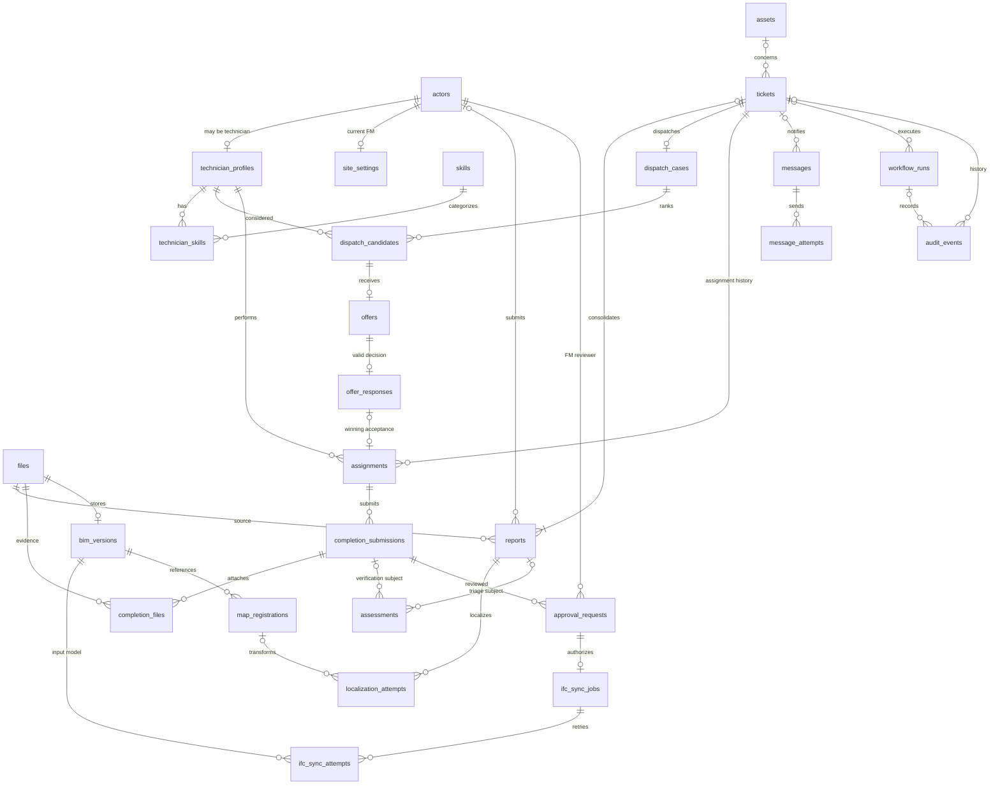

# CBM PostgreSQL database schema proposal

Approved design baseline. The database implementation is now in `database/migrations/`; see [implementation and setup](../database/README.md) for the installed objects, transaction functions and validation limits. This document remains the approved logical design. The legacy `schema.sql` and existing workflow exports remain unchanged pending integration.

## Scope and design decisions

The database covers the complete maintenance cycle: report intake, image localization, triage, WF1 dispatch, technician completion, AI verification, facility-manager approval or rework, and IFC synchronization.

The installation has **one building and one current facility manager**, as confirmed by the user. There are no organisations, tenants, multi-building access rules or FM assignment pools. A singleton settings row identifies the building and its FM. Historical decisions retain the identity of the person who made them if the FM later changes.

The main design change is to store operational entities in relational tables. An offer, response, assignment, repair submission and email attempt each have their own row. The audit log records what happened; it is not the authoritative container for the entire dispatch state. JSON is reserved for variable provider results, evidence metadata and event details.

There are **27 tables**, including small reference and relationship tables. This count reflects the separate records needed to preserve retries, evidence and rework history; it does not imply 27 workflow steps or tools. No payments, inventories, chat transcripts, technician vector database or general-purpose user-permission system is included.

## Naming and common conventions

- Each entity has a primary key `id`, unless a composite key is explicitly listed. Internal identifiers are bigint-compatible; ticket numbers continue to support filenames such as `TICKET-123_after.jpg`. Offers and approval requests also have an opaque unique public reference for callbacks.
- In the field lists below, `x -> table` means a foreign key. A question mark marks a relationship that can legitimately be absent. Lists show the important business fields, not every future SQL column declaration.
- Instants use timezone-aware timestamps. Appointment start and end are stored as instants and displayed in `Europe/Rome`. Durations such as 48 hours are elapsed durations. The site timezone is retained with scheduling snapshots.
- Mutable records have `created_at`, `updated_at` and a numeric `revision` where competing workflow writes are possible. Evidence, responses, delivery attempts and audit history are retained rather than overwritten.
- Referenced actors, assets and historical evidence are deactivated or retired rather than cascade-deleted with a ticket. Retention rules can be specified at implementation time.
- Human actions, agent decisions and software execution are distinguishable. An agent can initiate a tool call; the n8n execution and the resulting committed mutation are separately attributable.

## 1 Actors and site configuration

| Table | Purpose | Important fields and relationships |
|---|---|---|
| `site_settings` | The single building and current FM | Singleton `id`; building code/name; timezone; `facility_manager_actor_id -> actors`. No collection of buildings. |
| `actors` | Identifies people and automated participants | `id`; kind `HUMAN`, `AGENT` or `SERVICE`; name; contact email when applicable; stable external identity when verified; active flag. Reporter, technician and FM roles arise from their relationships below. |
| `technician_profiles` | Technician-specific eligibility and ranking information | `actor_id -> actors` is both PK and FK; available/active-for-dispatch flag; profile text; current rating, rating source and rating timestamp. Only human actors can have this profile. |
| `skills` | Controlled maintenance skill vocabulary | `id`; unique code; label; active flag. Initial codes match carpentry, plumbing, electrical, HVAC and general. |
| `technician_skills` | Skills possessed by each technician | Composite PK (`technician_actor_id -> technician_profiles.actor_id`, `skill_id -> skills`); valid-from and optional valid-until. |

One person has one actor record even if they both report an issue and work as a technician. There is no separate duplicated `reporters` or `facility_managers` contact table. A reporter does not need an application login. If an uploader's identity cannot be verified, the report keeps the supplied email as an assertion and leaves the verified actor reference empty; a filename alone does not authenticate a person.

Open job counts, last assignment time and completed-job counts are derived from assignments and approved closures. They are not incremented blindly on workflow retries. The current technician rating is an input to ranking, not a newly invented review process.

## 2 Files and the building model

| Table | Purpose | Important fields and relationships |
|---|---|---|
| `files` | References immutable versions of photos and IFC files | `id`; storage provider; external object/file ID; revision key; URI; MIME type; checksum when available; captured/uploaded timestamps; `uploader_actor_id? -> actors`; `derived_from_file_id? -> files`; image dimensions and capture/normalization metadata where relevant. |
| `bim_versions` | Versions of the building's IFC model | `id`; unique version label; `file_id -> files`; `parent_version_id? -> bim_versions`; current flag; `created_by_actor_id? -> actors`; published timestamp. At most one version is current. |
| `assets` | Maintainable IFC elements in this building | `id`; unique IFC GlobalId within this installation's model lineage; current class/name/storey; active flag; `first_seen_version_id -> bim_versions`; `last_seen_version_id -> bim_versions`. |
| `map_registrations` | Versioned alignment between MultiSet coordinates and the IFC frame | `id`; map code; registration revision; `reference_bim_version_id -> bim_versions`; axis convention; units; validated 4-by-4 transformation; validity dates; `calibrated_by_actor_id? -> actors`. Unique map-code/revision pair. |

Actual file bytes remain in Drive or model storage. The database stores reliable file IDs and version references, not only view URLs. `files` represents the exact original and normalized image versions used by an assessment. Camera intrinsics belong to those pixels and are retained in their metadata.

The asset record represents one stable physical element across IFC versions. Localization attempts store the version actually inspected and a snapshot of the matched element's labels, so later renaming does not rewrite earlier evidence. A replacement element with a new GlobalId is a new asset. This proposal assumes one IFC model lineage for the building, not a federation of independent models.

## 3 Intake localization and ticket creation

| Table | Purpose | Important fields and relationships |
|---|---|---|
| `reports` | Every incoming fault report, including duplicates and unsuccessful intake | `id`; unique source/idempotency key; `source_file_id -> files`; `reporter_actor_id? -> actors`; asserted reporter email; submitted description; received timestamp; processing/disposition status; `ticket_id? -> tickets`; attachment kind `INITIAL` or `ADDITIONAL_DUPLICATE` when linked. |
| `localization_attempts` | Each attempt to localize a report and identify an IFC element | `id`; `report_id -> reports`; `input_file_id -> files`; `registration_id? -> map_registrations`; observed map code; `bim_version_id? -> bim_versions`; `asset_id? -> assets`; map-frame position; transformed IFC-frame position; confidence; match distance; provider request ID; result/error; `workflow_run_id? -> workflow_runs`. |
| `assessments` | Immutable AI or human triage and repair-verification results | `id`; purpose `TRIAGE` or `REPAIR_VERIFICATION`; result status `SUCCEEDED`, `FAILED` or `PARSE_ERROR`; `report_id? -> reports`; `completion_id? -> completion_submissions`; `before_file_id -> files`; `after_file_id? -> files`; `assessor_actor_id -> actors`; model/provider and prompt version when AI; category, severity, `required_skill_id? -> skills` for triage; nullable repair verdict/confidence for verification; observations; raw provider result; `workflow_run_id? -> workflow_runs`. |
| `tickets` | One maintenance case and its current lifecycle state | `id`; status; `asset_id? -> assets`; `selected_localization_id? -> localization_attempts`; `adopted_triage_assessment_id? -> assessments`; effective category, severity, description, `required_skill_id? -> skills`; `responsible_fm_actor_id -> actors`; opened/closed timestamps; revision. |

Relationships and rules:

1. A ticket has one or more linked reports once created; each report belongs to at most one canonical ticket. A duplicate is another report attached to that ticket, not a second dispatch. Reports may exist before any ticket can be identified.
2. A report has zero or more localization attempts and triage assessments. A failed attempt is retained. A selected localization must belong to a report linked to that same ticket.
3. An assessment is for exactly one subject: a report for triage, or a completion submission for repair verification. Verification identifies the exact before/after files examined. Later assessments do not overwrite earlier ones.
4. The ticket's adopted assessment must be triage for one of its reports. Ticket fields are the effective operational values; the adopted assessment preserves their evidence. An authorised human correction updates effective values and adds an audit event.
5. A manual-triage ticket may initially lack an asset, successful localization or required skill. Dispatch is prohibited until those required facts are resolved.
6. To retain the current duplicate policy, there is at most one nonterminal ticket per identified asset. This intentionally treats simultaneous reports on the same element as one case, even if their text differs. Distinct simultaneous faults per asset would require a separate policy decision.

Suggested ticket states are `RECEIVED`, `NEEDS_TRIAGE`, `LOCALIZED`, `DISPATCHING`, `ASSIGNED`, `WORK_DONE`, `PENDING_APPROVAL`, `REWORK`, `ESCALATED`, `CLOSED`, and an explicitly authorised `CANCELLED` state. An escalated ticket remains open; operator intervention is not closure. Duplicate classification belongs to reports.

## 4 Dispatch offers responses and assignment

| Table | Purpose | Important fields and relationships |
|---|---|---|
| `dispatch_cases` | Durable coordination state for one ticket | `id`; unique `ticket_id -> tickets`; operational state; policy version; severity/urgency snapshot; maximum simultaneous offers; 48-hour duration snapshot; urgent appointment start/end when applicable; timezone; next recovery time; failure count; halted flag/reason; revision. |
| `dispatch_candidates` | The frozen ranked shortlist and ranking evidence | `id`; `dispatch_id -> dispatch_cases`; `technician_actor_id -> technician_profiles`; rank 1–5; selected timestamp; open-job count, last-assignment timestamp, rating and skill eligibility snapshots. Unique dispatch/technician and dispatch/rank pairs. |
| `offers` | One job offer to one shortlisted technician | `id`; unique public reference; `candidate_id -> dispatch_candidates`; `dispatch_id -> dispatch_cases`; capacity slot 1 or 2; state; reserved timestamp; acknowledged-send timestamp; response deadline; appointment start/end; response-token digest; token expiry/revocation; terminal reason and timestamps. One offer per candidate for this dispatch. |
| `offer_responses` | The first valid persisted decision for an offer | `id`; unique `offer_id -> offers`; `dispatch_id -> dispatch_cases`; decision `ACCEPT` or `DECLINE`; database receipt timestamp; per-dispatch receipt order; channel; identity-verification basis; processing state/result; processed timestamp; `workflow_run_id? -> workflow_runs`. |
| `assignments` | The technician actually responsible for the work | `id`; `ticket_id -> tickets`; `technician_actor_id -> technician_profiles`; `winning_response_id? -> offer_responses`; origin `OFFER_ACCEPTANCE` or `MANUAL`; `assigned_by_actor_id -> actors`; assigned/end timestamps; status; fixed appointment start/end; manual reason when applicable. |

The ticket does not independently store another mutable assignee. Its active assignment supplies that relationship. Historical assignments remain available if an FM explicitly reassigns work. Reassignment is supported by the data model; it is not an extra autonomous agent capability.

Dispatch integrity requirements:

- One dispatch case per ticket and at most five shortlisted technicians. Ranking remains fewest open jobs, oldest assignment with never-assigned first, highest rating, then technician ID. The site is fixed, so no building-coverage join is needed.
- Ordinary severity 1–3 permits one active offer; urgent severity 4–5 permits two. Reserved, sending/live and unresolved-delivery offers cannot allow the capacity rule to be bypassed. Capacity-slot occupancy and transitions are checked atomically under the dispatch/ticket lock.
- All offers refer to a candidate from their own dispatch. Candidate identity cannot be replaced by a model-supplied email address. The next eligible unoffered shortlist member must be chosen; current eligibility is rechecked on acceptance.
- Ordinary response deadlines are 48 elapsed hours after the recorded send acknowledgement. Urgent deadlines are the earlier of that instant and the fixed appointment start. The urgent next-business-day 08:00–10:00 appointment is not postponed. Ordinary appointments remain fixed afternoon slots after the response window.
- The acknowledged send time must not silently change an already emailed appointment. If a delayed acknowledgement creates an ordinary appointment/deadline conflict, the dispatch needs operator handling rather than silently rewriting the promised slot.
- Store the actual deadline on the offer; do not recompute it from current settings after restart. Reject a response at or after that deadline even if a periodic expiry worker has not run yet.
- Only validated POST submissions create canonical response rows. Opening a GET confirmation page is not a response. A replay does not create a second decision. Known invalid, late or superseded attempts may be recorded as audit events without storing the secret token.
- Receipt order is allocated while holding the ticket/dispatch lock and committed with the validated response. Processing follows that order; it cannot choose a later acceptance because an agent happened to see it first. A bare auto-increment ID alone is not assumed to prove transaction commit order.
- At most one active assignment per ticket, and at most one assignment for a winning response. The winner's response must be an eligible acceptance for that same ticket and technician. Assignment and withdrawal of competing offers are one coordinated transition.
- An expired offer cannot be accepted. An unresolved Gmail delivery remains an operational halt even when the offer's business deadline has passed. Expiry does not prove whether an email was sent.

## 5 Work completion FM approval and rework

| Table | Purpose | Important fields and relationships |
|---|---|---|
| `completion_submissions` | Each submitted repair result, including later rework | `id`; `assignment_id -> assignments`; submission number; unique source/idempotency key; `submitted_by_actor_id? -> actors`; asserted uploader identity; notes; submission timestamp; status; `supersedes_completion_id? -> completion_submissions`. |
| `completion_files` | Photos/evidence attached to a repair submission | Composite PK (`completion_id -> completion_submissions`, `file_id -> files`); evidence role; display order. |
| `approval_requests` | One FM review cycle and its terminal outcome | `id`; `completion_id -> completion_submissions`; `verification_assessment_id? -> assessments`; `requested_from_actor_id -> actors`; request sequence; unique public reference; requested/sent/deadline timestamps; status `PENDING`, `APPROVED`, `REJECTED`, `EXPIRED` or `SUPERSEDED`; `decided_by_actor_id? -> actors`; decision timestamp; rejection/review reason; response-token digest or provider wait reference. |

Relationships and rules:

- A ticket can have historical assignments, and each assignment can have many completion submissions. A submission belongs to exactly one assignment. An unmatched uploaded file remains in `files`, with an audit event; it is not attached to an invented assignment.
- A completion can have multiple images, multiple verification assessments and multiple sequential review requests. It has at most one pending approval request at a time. A later review or re-upload does not erase the previous attempt.
- The verification assessment referenced by a request must concern that same completion. The FM sees the exact evidence and verdict that were submitted for review.
- Each request has at most one immutable terminal decision. A rejected repair creates `REWORK`; the technician submits a new completion linked to the previous one. Resending the same logical approval email is a message retry, not a new approval request.
- The reviewer must be the authorised FM. A change of FM supersedes the outstanding request and creates a new one for the new reviewer; old links cannot approve new evidence.
- The existing WF2 wait limit is 72 hours, separate from the 48-hour technician-offer rule. Store each approval deadline explicitly. An expired request is neither approval nor rejection and must not automatically become rework.
- The AI verdict is advisory. Only an explicit valid FM approval of the current submission permits closure. Late approval of a superseded submission cannot close a ticket with newer pending work.

## 6 Notifications and provider delivery

| Table | Purpose | Important fields and relationships |
|---|---|---|
| `messages` | One logical notification to one recipient | `id`; unique idempotency key; `ticket_id? -> tickets`; `report_id? -> reports`; `file_id? -> files` for unmatched-upload alerts; `offer_id? -> offers`; `approval_request_id? -> approval_requests`; `recipient_actor_id? -> actors`; recipient-address snapshot; channel; purpose; template version; subject/body or rendering payload; status; created timestamp; next attempt time. |
| `message_attempts` | Every attempt to send or reconcile that message | `id`; `message_id -> messages`; attempt number; unique claim reference; claimed/sent/finished timestamps; provider and account reference; provider message ID; result `CLAIMED`, `ACKNOWLEDGED`, `FAILED` or `UNCERTAIN`; error details; `reconciled_by_actor_id? -> actors`; reconciliation timestamp/result; `workflow_run_id? -> workflow_runs`. |

Messages include manual-triage alerts, FM ticket opening, technician offers, assignment confirmation, offer withdrawal, exhaustion/escalation, dispatch error, unmatched completion uploads, approval requests, rework requests and closure notifications.

A message is not an offer: it is the delivery of information about an offer or another event. A logical message can have several explicitly permitted attempts, while its idempotency key prevents multiple workflow retries from creating duplicate logical notifications. Each offer has exactly one logical invitation message; subsequent assignment or withdrawal notices have their own keys.

Reserve/claim records before calling Gmail. A provider acknowledgement is different from recipient delivery or reading. A missing receipt is uncertain; it is not permission to send again. Operator reconciliation records who resolved the uncertainty. Gmail and PostgreSQL cannot provide a single shared transaction, so the schema does not promise exactly-once external delivery.

Offer and approval tokens are stored as digests in the operational entities. Message rendering data containing actionable links is restricted to sending tools; it must not be returned by general agent context reads. Credentials and API keys stay in n8n credentials, outside these tables.

## 7 IFC synchronization and execution history

| Table | Purpose | Important fields and relationships |
|---|---|---|
| `ifc_sync_jobs` | One requested maintenance update following FM approval | `id`; unique `approval_request_id -> approval_requests`; `asset_id -> assets`; unique operation/idempotency key; maintenance payload snapshot; status `PENDING`, `IN_PROGRESS`, `SUCCEEDED`, `FAILED` or `UNCERTAIN`; `result_bim_version_id? -> bim_versions`; next retry time; created/completed timestamps. |
| `ifc_sync_attempts` | Attempts to execute or reconcile an IFC update | `id`; `job_id -> ifc_sync_jobs`; attempt number; `input_bim_version_id -> bim_versions`; `output_bim_version_id? -> bim_versions`; start/finish timestamps; provider/request reference; outcome and error; `workflow_run_id? -> workflow_runs`. |
| `workflow_runs` | Traceability for n8n executions and agent invocations | `id`; n8n instance reference, workflow ID/version and execution ID; `parent_run_id? -> workflow_runs`; `ticket_id? -> tickets`; `report_id? -> reports`; `executor_actor_id -> actors`; trigger kind; correlation key; model/prompt version when relevant; start/end times; outcome and error summary. |
| `audit_events` | Append-only history of domain changes and exceptional outcomes | `id`; event type/schema version; database-recorded timestamp; `actor_id -> actors`; `workflow_run_id? -> workflow_runs`; `ticket_id? -> tickets`; relevant typed FKs such as report, asset, offer, response, assignment, completion, approval, message, sync job or affected actor; correlation/causation reference; previous/new state where relevant; diagnostic JSON details. |

An IFC sync job must originate from an approved review of the same ticket and asset. Each retry remains attached to that one job, so retrying a closure does not request a second logical maintenance update. Actual IFC-service idempotency will also be needed at implementation time; the database row alone cannot prevent duplicate external writes after a lost response.

Only one model update may publish a successor to the current IFC version at a time, even when different tickets are approved together. The model-version transition and the service operation require serialization or an equivalent concurrency protocol. A failed synchronization does not replace a version filename with a sentinel string such as `IFC_SYNC_FAILED`.

Operational closure and BIM synchronization have separate states. To represent the current intended WF2 behavior, an approved ticket may be closed while its IFC job remains pending or failed. A notification must then say that model synchronization is outstanding, rather than claiming the IFC update succeeded.

Runs and events can exist before a ticket does. This covers invalid filenames, failed localization, malformed AI results and other pre-ticket problems. A helper run can point to its parent WF1 run. We store a concise model decision/result and tool outcome when useful, not private model reasoning or a mandatory conversation transcript.

## Relationship overview

The diagram shows the principal links. Optional context references and self-references are described in the table definitions. In particular, the two alternative assessment subject links are mutually exclusive, and at most one historical assignment is active.

## Event coverage

The following event families belong in `audit_events`. Events are recorded alongside the corresponding state change where both are in PostgreSQL. Event history supplements, rather than replaces, canonical records.

| Stage | Events to retain | Authoritative records affected |
|---|---|---|
| Actors and configuration | ACTOR_REGISTERED, ACTOR_DEACTIVATED, TECHNICIAN_AVAILABILITY_CHANGED, TECHNICIAN_SKILL_CHANGED, TECHNICIAN_RATING_CHANGED, FM_CHANGED | actors, technician_profiles, technician_skills, site_settings |
| Model and alignment | MODEL_VERSION_REGISTERED, MODEL_VERSION_PUBLISHED, ASSET_REGISTERED, ASSET_RETIRED, MAP_REGISTRATION_CREATED | files, bim_versions, assets, map_registrations |
| Intake | FILE_REGISTERED, FILE_NORMALIZED, REPORT_RECEIVED, SOURCE_REPLAY_IGNORED, REPORT_ATTACHED_TO_TICKET, DUPLICATE_REPORT_LINKED, INVALID_UPLOAD_DETECTED | files, reports, tickets |
| Localization and triage | LOCALIZATION_SUCCEEDED, LOCALIZATION_FAILED, ASSET_MATCHED, TRIAGE_RECORDED, TRIAGE_PARSE_FAILED, MANUAL_TRIAGE_REQUIRED, TRIAGE_CORRECTED, TICKET_CREATED | localization_attempts, assessments, tickets |
| Dispatch | DISPATCH_INITIALIZED, SHORTLIST_RECORDED, OFFER_RESERVED, OFFER_SENT, OFFER_EXPIRED, OFFER_WITHDRAWN, CANDIDATE_INELIGIBLE, DISPATCH_ESCALATED | dispatch_cases, dispatch_candidates, offers |
| Responses and assignment | RESPONSE_RECORDED, RESPONSE_REPLAY_IGNORED, RESPONSE_REJECTED, OFFER_DECLINED, ACCEPTANCE_SUPERSEDED, TICKET_ASSIGNED, ASSIGNMENT_ENDED, MANUAL_ASSIGNMENT_RECORDED | offer_responses, offers, assignments, tickets |
| Notifications | MESSAGE_QUEUED, DELIVERY_CLAIMED, SEND_ACKNOWLEDGED, SEND_FAILED, DELIVERY_UNCERTAIN, DELIVERY_RECONCILED | messages, message_attempts |
| Recovery | INITIALIZATION_FAILED, DISPATCH_EXECUTION_INCOMPLETE, RECOVERY_SCHEDULED, RECOVERY_STARTED, OPERATOR_ACTION_REQUIRED, DISPATCH_RESUMED | dispatch_cases, workflow_runs, audit_events |
| Completion and review | COMPLETION_SUBMITTED, COMPLETION_UPLOAD_UNMATCHED, VERIFICATION_RECORDED, VERIFICATION_FAILED, APPROVAL_REQUESTED, APPROVAL_EXPIRED, APPROVAL_SUPERSEDED, FM_APPROVED, FM_REJECTED, REWORK_REQUIRED, TICKET_CLOSED | completion_submissions, completion_files, assessments, approval_requests, tickets |
| IFC synchronization | IFC_SYNC_QUEUED, IFC_SYNC_STARTED, IFC_SYNC_SUCCEEDED, IFC_SYNC_FAILED, IFC_SYNC_UNCERTAIN, IFC_SYNC_RECONCILED | ifc_sync_jobs, ifc_sync_attempts, bim_versions |

For rejected operations, the event states the reason and the known subject identifiers. It must not falsely record the requested mutation as successful. An agent choosing a tool does not by itself create an OFFER_SENT, TICKET_ASSIGNED or FM_APPROVED business event.

## Integrity and concurrency boundary

Primary keys, foreign keys, uniqueness and row-local checks will cover identities, valid ranges and same-record relationships. Proposed uniqueness includes singleton site settings, source idempotency, shortlist ranks, candidate offers, canonical offer decisions, logical message keys and IFC job keys.

Filtered uniqueness can protect one current BIM version, one active assignment and one pending review within their respective scopes. Cross-record membership must also be enforced: a response, assignment, approval or IFC job cannot be attached to a different ticket merely because each individual ID exists. Composite references and guarded transitions will be designed for those relationships.

The offer-count limit, valid state transitions, receipt ordering, current FM authority and first-winner selection require coordinated transactions; they cannot all be represented by independent `CHECK` constraints. PostgreSQL explicitly limits row checks and provides row locking for coordinating competing writes. This is an implementation boundary, not SQL implementation in this proposal. References: [PostgreSQL constraints](https://www.postgresql.org/docs/current/ddl-constraints.html), [PostgreSQL explicit locking](https://www.postgresql.org/docs/current/explicit-locking.html).

## What this replaces in the current database

| Current storage | Proposed replacement |
|---|---|
| Technician email/name mixed with skills array and mutable statistics | actors, technician_profiles, skills, technician_skills; statistics derived from work history |
| FM hardcoded in workflow configuration | site_settings current FM, plus explicit reviewer/responsible-FM references and recipient snapshots |
| Source identity in CBM_SOURCE event JSON | unique report source key and reports.ticket_id |
| Full dispatch snapshot in CBM_DISPATCH_STATE | dispatch_cases, dispatch_candidates, offers, assignments and messages |
| Technician decisions in CBM_RESPONSE event JSON | offer_responses |
| One before/after URL on a ticket | files, report source file, completion submissions and completion_files |
| Missing or inconsistent WF2 verification/approval fields | assessments and approval_requests, with current ticket status |
| A single overwritten rejection or completion result | successive completion submissions and immutable review outcomes |
| IFC version text or failure sentinel on tickets | bim_versions, ifc_sync_jobs and ifc_sync_attempts |
| Nested audit items inside dispatch snapshots | append-only audit_events linked to canonical entities and workflow_runs |

This schema is not a drop-in replacement for the existing three-table database. Adopting it in the running application requires explicit legacy-data migration and updates to WF1/WF2 SQL, plus IFC-service idempotency and version coordination. Those integration changes are separate from the database implementation.
