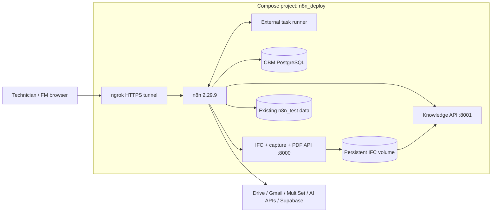

# Historical installation tutorial

**For the current installed demo, use [RUN_DEMO_GUIDE.md](RUN_DEMO_GUIDE.md) or its [readable HTML version](RUN_DEMO_GUIDE.html).** The guide below describes the earlier installation. Its workflow counts, credential status and report-upload instructions are historical.

# CBM tutorial for your Maddaloni office case study

**Intake and authorization revision, 15 September 2026. Baseline: your running n8n 2.29.9. Application: release 2026.09.14 plus the separate 2026.09.15 deployment adaptation.**

You can extend your current deployment. The existing n8n database, credentials and ngrok configuration stay in place. The extension adds a matching external task runner, two Python API containers, a CBM PostgreSQL database and persistent IFC storage.

This revision supersedes the earlier generic hosting instructions. It is based on inspected files and actual Docker/n8n tests. The original application release directories are preserved; the demo uses a copy under `n8n_deploy/cbm/app`.

The local application release passed 395 offline checks. For this extension, the images were built on Docker Desktop Linux, all 14 prepared workflows were imported into an isolated n8n 2.29.9 instance, and real runtime/service tests were performed. Gmail, Drive, MultiSet, model providers and Supabase require your credentials and the live acceptance scenarios below. Importing templates is not the same as completing those live tests.

Read [CASE_STUDY_GUIDE.md](CASE_STUDY_GUIDE.md) first. It identifies the real IFC, all eleven photos, the audited intrinsics, map `MAP_J964JX6MGEGO`, and the exact Drive-to-maintenance demonstration. The model is now your office IFC2X3, with 13 maintainable assets. No synthetic IFC is generated.

The case-study route identifies the asset automatically using VPS/IFC candidates and the existing vision-model call. Failure requests another photo, up to three replacements after the original, then records a bug and notifies IT. The FM authorizes the maintenance intervention only after identification succeeds; no technician is contacted beforehand. WF2 completion acceptance remains a separate decision. Read [INTAKE_APPROVAL_GUIDE.md](INTAKE_APPROVAL_GUIDE.md) for the new process, SQL migration and retry filenames. The existing case-study volumes are reused. MultiSet credentials and measured map registration remain live configuration tasks.

## Contents

1. [Your actual deployment and the changes](#1-your-actual-deployment-and-the-changes)
2. [Install, configure and start the extension](#2-install-configure-and-start-the-extension)
3. [Check the containers and Python services](#3-check-the-containers-and-python-services)
4. [Prepare credentials, technicians and workflows](#4-prepare-credentials-technicians-and-workflows)
5. [WF1: every trigger explained](#5-wf1-every-trigger-explained)
6. [WF1: intake, dispatch and the seven helpers](#6-wf1-intake-dispatch-and-the-seven-helpers)
7. [The two knowledge pipelines](#7-the-two-knowledge-pipelines)
8. [WF2: completion, FM approval and IFC writing](#8-wf2-completion-fm-approval-and-ifc-writing)
9. [WF3: FM chat and weekly reports](#9-wf3-fm-chat-and-weekly-reports)
10. [Run a complete demonstration](#10-run-a-complete-demonstration)
11. [Operate, update and recover the deployment](#11-operate-update-and-recover-the-deployment)
12. [Acceptance tests and troubleshooting](#12-acceptance-tests-and-troubleshooting)

## 1. Your actual deployment and the changes

### 1.1 The two folders are parts of one environment

| Actual path | Role |
|---|---|
| `C:\Users\USER\Desktop\n8n_deploy` | Active Compose project, Dockerfile and private `.env` |
| `C:\Users\USER\Desktop\n8n_test` | Existing persistent n8n data, mounted at `/home/node/.n8n` |
| `C:\Users\USER\Desktop\n8n_test\Nuova cartella` | Alternate older deployment files, not an independent test environment |

The inspected active container was `n8n_v1`, running n8n **2.29.9**, launched from `n8n_deploy/docker-compose.yml`. The nested alternate Dockerfile specifies **2.23.4** and shares container names and storage with the active setup. Do not launch that alternate configuration as a second environment or use it to downgrade the running instance.

The existing n8n data directory includes its SQLite database, workflow/credential records and binary storage. CBM's new PostgreSQL database is for maintenance tickets. These databases have different purposes; this extension does not migrate n8n from SQLite.

### 1.2 What was corrected

| Inspected issue | Extension behavior |
|---|---|
| n8n base used `latest` | n8n and runner pinned to 2.29.9 and image digests |
| Dockerfile installed `pdf-parse@latest` with `|| true` | Reproducible dependency installation fails visibly; no swallowed install errors |
| Installed parser was 2.4.5, while original WF2 called its 1.x API | Demo WF2 now calls Python `pypdf` through `/reports/extract` |
| Trying 1.1.1 in a secure runner failed when legacy PDF.js wrote to frozen Error prototypes | No runner security relaxation; Python handles CBM PDF extraction |
| `crypto` absent from the module allowlist | Added to the JavaScript runner's actual configuration |
| External runner not explicitly configured | Matching external runner with private broker connection |
| No Python APIs/shared IFC volume in Compose | Two Python services and persistent shared model volume added |
| Fixture technicians used `example.com` addresses | Disabled during fresh CBM database initialization |
| Some template workflows lacked CLI-import IDs; old helper IDs could collide | Preparation assigns a separate demo ID namespace and rewrites helper references |

The runner retains **`pdf-parse` 2.4.5** for compatibility with your other workflows, but the adapted CBM pipeline does not use it. Do not change it to 1.x to follow the older tutorial. The deployment adds `demo_api.py` around the existing IFC app and changes only the demo copy's WF2 report-extraction node. Its downstream evidence fields and FM approval contract remain the same.

### 1.3 One Compose project, several containers



| Compose service | Purpose |
|---|---|
| `n8n` | Main workflows, HTTP nodes and saved helper workflows |
| `task-runners` | JavaScript Code execution with the configured imports |
| `ngrok` | Public access to n8n callbacks, approval links and chat |
| `cbm-postgres` | New maintenance-ticket database |
| `ifc-init` | One-shot import of the supplied office IFC; an exit code of 0 is normal |
| `ifc-service` | IFC operations, capture normalization and report PDF extraction |
| `knowledge-service` | Approved-source snapshot extraction |

The helper workflows remain inside n8n. `capture_normalize.py` is an imported module, not another container. `initialize_model.py` imports the supplied IFC; `calibrate_registration.py` is an optional setup utility. The sample generator is not used in this deployment or included in its runtime image. The runner's optional native Python support is also distinct from the two application API services.

All services use the project's Docker network. n8n calls `http://ifc-service:8000`; it does not call its own `localhost` for Python. Ngrok forwards to `n8n:5678`. Neither the Python API ports nor PostgreSQL's port are published publicly. [Compose service discovery](https://docs.docker.com/compose/how-tos/networking/).

## 2. Install, configure and start the extension

### 2.1 Files supplied

The separate extension package contains the corrected Compose/Docker files, an application copy, setup/test scripts, a runtime-check workflow and this guide. Its installer targets your inspected `n8n_deploy` directory and preserves the original `.env`.

Use **PowerShell 7.3 or newer**. The scripts declare this requirement so native Docker command arguments and JSON handling behave consistently. Docker Desktop must be running. You do not need to install Python, Node.js or PostgreSQL on Windows just to operate this containerized demo.

The package installer is:

```powershell
& 'C:\Users\USER\Desktop\Progetti Dottorato\ISTEA_2026\Progetto_ISTEA\15_09_2026 CBM Intake Approval Release\Install-CbmExtension.ps1'
```

Run this only when installing/updating the supplied files. It backs up the original deployment files under `n8n_deploy/backups/config-before-case-study-*`, copies the extension, creates new private CBM keys only if absent, and applies the WF2 PDF and WF1 case-study changes to the application copy. It also backs up the previous CBM files and sets the confirmed map code. It does not start containers or import workflows.

If the extension has already been applied for you, begin with the checks in section 3. Re-running the installer is unnecessary for a normal demo session.

### 2.2 Two environment files

| File | Contents | Rule |
|---|---|---|
| `n8n_deploy/.env` | Existing n8n encryption key, ngrok domain and ngrok token | Preserve it; never generate a replacement encryption key for the existing database |
| `n8n_deploy/cbm/cbm.env` | New runner token, CBM PostgreSQL password, knowledge API key, MultiSet map and registration settings | Generated once; edit only the settings you intend to change |

From PowerShell:

```powershell
Set-Location -LiteralPath 'C:\Users\USER\Desktop\n8n_deploy'
.\scripts\deployment\Initialize-Cbm.ps1
.\scripts\deployment\Cbm-Compose.ps1 config --quiet
```

Initialization preserves existing CBM secrets on subsequent runs. Do not regenerate the PostgreSQL password after its volume is initialized: changing the environment variable alone does not change the password stored in an existing database.

The `scripts/deployment/Cbm-Compose.ps1` wrapper always supplies both environment files and the original project name. Use it instead of a bare `docker compose` command for this deployment. Do not paste either private environment file into chat or commit it to a repository.

The installer sets `MULTISET_MAP_CODE=MAP_J964JX6MGEGO`. The query requests RHS Y-up poses. Use the reviewed direct transform in `cbm/case-study/registration.json` for this case; it starts unapproved. The legacy `AXIS_MODE` and `MULTISET_TO_IFC_MATRIX` variables are not the case-study resolver's registration controls. See section 6 of the case-study guide.

The public n8n settings keep `WEBHOOK_URL`, which is appropriate for your pinned 2.29.9 version. This guide does not switch you to a variable introduced in a newer version. Your existing ngrok hostname stays in `.env`; the application callback base becomes `https://<that-hostname>/webhook` during workflow preparation.

### 2.3 The first container update

```powershell
.\scripts\deployment\Start-Cbm.ps1
```

This script first validates configuration and builds the required images while the old n8n can still run. It then records the current image under a rollback tag, stops n8n briefly, copies the complete `n8n_test` directory consistently, and starts the extended project. The backup also includes both private environment files. A backup failure restarts the old container and stops the procedure.

Backups go under `n8n_deploy/backups/before-start-*`. The script does not delete containers' volumes or reset n8n. Existing published workflows resume when n8n starts. The new CBM templates are **not** automatically imported or published.

On a fresh case-study volume, `ifc-init` verifies and copies `Base ufficio.ifc` as `office_v1.ifc` byte for byte. It stores source identity and preserves later versions on restart. It refuses a conflicting or incomplete lineage. The original case-study files and former synthetic volumes stay intact.

### 2.4 Local layout after installation

```text
C:\Users\USER\Desktop\n8n_deploy\
  .env                         existing private n8n/ngrok settings
  docker-compose.yml           extended project
  Dockerfile                   pinned n8n image
  scripts\
    deployment\                Start-Cbm (backed-up build/start), Cbm-Compose (Compose wrapper), Test-Cbm (checks)
    workflows\                 Prepare-CbmWorkflows (14 inactive demo exports), Apply-CbmCompatibility
    demo\                      Set-CbmDemoTechnicians (controlled recipients), Prepare-CaseStudyPhotos
  database\                    SQL mounted into cbm-postgres on first start
  docs\                        guides and per-workflow notes
  cbm\
    cbm.env                    new private CBM settings
    app\                       copy of the application, with adapted WF2
    demo.local.json            your FM email and Drive folder IDs
    workflows-configured\      files to import after preparation
    Runtime-Check.json          manual, non-provider runtime test
    catalog\catalog.local.json approved source catalog
    catalog\documents\         reviewed production-knowledge inputs
    technical_sheets\          independent OCR-demo PDF inputs
    demo_api.py                 additional PDF extraction endpoint
    task-runners.json           actual runner configuration
  backups\                     configuration/data backups
```

The manufacturer PDFs remain local inputs and are excluded from the distributable archive. On this computer, the installer can copy the three existing local PDFs from the staged extension. If deploying the ZIP elsewhere, supply those files yourself.

## 3. Check the containers and Python services

### 3.1 Infrastructure checks

```powershell
Set-Location -LiteralPath 'C:\Users\USER\Desktop\n8n_deploy'
.\scripts\deployment\Test-Cbm.ps1
```

The script waits for n8n readiness and checks its version, the retained compatibility package, IFC health, an authenticated knowledge snapshot, n8n-to-IFC connectivity and the CBM PostgreSQL tables. It reads the knowledge key inside the container without printing it.

Expected service status: n8n, runner, ngrok, PostgreSQL and both Python APIs are running; `ifc-init` is **Exited (0)**. An empty approved catalog returns zero knowledge chunks. That is a valid initial connectivity test, not a populated retrieval library.

For logs:

```powershell
.\scripts\deployment\Cbm-Compose.ps1 ps -a
.\scripts\deployment\Cbm-Compose.ps1 logs --tail 50 n8n task-runners ifc-service knowledge-service cbm-postgres
```

### 3.2 Test the actual n8n Code runtime

Import `C:\Users\USER\Desktop\n8n_deploy\cbm\Runtime-Check.json` and execute it manually. It verifies Code-node HTTP/binary helpers, `crypto`, environment access, PDF extraction, camera metadata and the real 13-asset IFC. Expect `ok:true`, `assetCount:13`, `cameraCalibrated:false`, `binaryRoundtrip:true`, and the actual office active filename. `caseStatus.registration_verified:false` is the expected initial state.

This workflow has no provider calls. The separate `cbm/Case-Study-Localization-Check.json` submits the eleven case images to your real MultiSet map after you bind its credential. It creates no tickets and sends no emails. See the case-study guide before running it.

The tested n8n 2.29.9 runner supports these HTTP/binary helper calls. The deployment sets `N8N_BLOCK_ENV_ACCESS_IN_NODE=false` because workflows use `$env`; workflow editors must therefore be trusted with that capability. [Runner configuration](https://docs.n8n.io/deploy/host-n8n/configure-n8n/set-up-task-runners).

### 3.3 Look at the IFC model without installing Python locally

```powershell
.\scripts\deployment\Cbm-Compose.ps1 exec -T ifc-service python -c 'import json,urllib.request; print(json.dumps(json.load(urllib.request.urlopen("http://127.0.0.1:8000/elements")),indent=2))'
```

The case-study radiator is `3kcZF9AH16IwPfuL_CGFlR`; the outlet is `1qMgWWNHzE3egAZbWFbgXF`. Both are `IfcBuildingElementProxy`. The importer preserves the original IDs; inspect the output if you later change the source model.

To inspect the active filename:

```powershell
.\scripts\deployment\Cbm-Compose.ps1 exec -T ifc-service python -c 'from pathlib import Path; print(Path("/app/models/active_model.txt").read_text())'
```

Both APIs read the named volume `n8n_deploy_cbm_case_models`. The knowledge service mounts it read-only. The Python APIs do not need another ngrok tunnel, public host ports, or a browser CORS change.

## 4. Prepare credentials, technicians and workflows

### 4.1 The CBM database is initialized once; existing volumes need the intake migration

The PostgreSQL container applies these files in order when its new data volume is empty: `schema.sql`, `schema_dispatch_functions.sql`, `schema_wf2_completion.sql`, `schema_wf3_dashboard.sql`, `schema_release_review.sql`, then a demo-only script disabling fictional recipient addresses.

It does not rerun the scripts against an existing database on every restart. Do not install `app/database/migrations/`: that separate design study is not the schema used by these workflows.

Create an n8n Postgres credential named **CBM Postgres** with:

| Field | Value |
|---|---|
| Host | `cbm-postgres` |
| Port | `5432` |
| Database | `cbm_demo` |
| User | `cbm_app` |
| Password | `CBM_POSTGRES_PASSWORD` from your private `cbm/cbm.env` |
| SSL | Disabled for this private local Docker connection |

No Windows PostgreSQL installation is required. To enter its SQL shell:

```powershell
.\scripts\deployment\Cbm-Compose.ps1 exec cbm-postgres psql -U cbm_app -d cbm_demo
```

Run the SQL examples later in this guide there, and use `\q` to exit. The CBM database is separate from n8n's own SQLite storage and from Supabase.

Run `scripts/deployment/Apply-CbmIntakeMigration.ps1` against an existing case-study database. `scripts/deployment/Start-Cbm.ps1` also invokes it after startup. This adds durable report/capture/IT-issue/outbox state and the pre-dispatch authorization guard; it does not reset existing business data. Set `itEmail` in `cbm/demo.local.json` to `giuseppe.desiderio123@gmail.com` or another approved IT address.

### 4.2 Configure two controlled technicians

Replace the addresses with real mailboxes or aliases you control:

```powershell
.\scripts\demo\Set-CbmDemoTechnicians.ps1 -Email1 'YOUR_FIRST_DEMO_ADDRESS' -Email2 'YOUR_SECOND_DEMO_ADDRESS'
```

The script creates/updates two demo technicians with all five demo skills in `building-A`. It performs database writes only; it does not send mail. Its broad skills are a synthetic testing convenience, not a real qualification record. At least two eligible technicians are needed to demonstrate urgent concurrent offers.

### 4.3 Prepare deployment-specific workflow files

Create two Drive folders: incoming snapshots and completed reports/photos. Give the n8n Drive credential access to both. Then copy and edit the local settings file:

```powershell
Copy-Item -LiteralPath '.\cbm\demo.example.json' -Destination '.\cbm\demo.local.json'
```

Do this copy only if `demo.local.json` does not already exist. Fill in:

```json
{
  "fmEmail": "YOUR_CONTROLLED_FM_EMAIL",
  "incomingFolderId": "YOUR_INCOMING_DRIVE_FOLDER_ID",
  "completedFolderId": "YOUR_COMPLETED_DRIVE_FOLDER_ID"
}
```

Now run:

```powershell
.\scripts\workflows\Prepare-CbmWorkflows.ps1
```

The script reads the public domain from your existing `.env`; sets the callback host, FM address, Drive folders and internal knowledge URL; reapplies the Python report-extraction adaptation; and creates **14 inactive workflow exports** in `cbm/workflows-configured`.

Each gets an ID beginning `cbmIntake20260915`, and helper references are rewritten consistently. Imported names begin `[CBM Intake Approval 2026.09.15]`. The behavioral sections below omit that prefix for readability. `workflow-ids.json` is a reference manifest, **not a workflow to import**.

Preparation never reads provider API keys, imports workflows, activates triggers or sends email. n8n credential placeholders still need binding in the editor. Re-running preparation refreshes the generated files, so preserve your n8n-configured exports separately if you need to keep editor changes.

### 4.4 Credentials to bind in n8n

| Credential | Used by |
|---|---|
| Google Drive OAuth | WF1 incoming images; WF2 reports and photos |
| Gmail OAuth | Offers, notices, FM approval, reports and error notifications |
| CBM Postgres | Maintenance business state and history |
| Supabase Postgres | Knowledge generation/publication and source verification |
| Supabase backend API | Native vector stores |
| Anthropic | Triage, assessment and agents |
| OpenAI | Embeddings |
| MultiSet M2M Basic Auth | Localization; also configure the actual map code |
| Header Auth: `X-CBM-Knowledge-Key` | Use `CBM_KNOWLEDGE_KEY` from `cbm/cbm.env` |
| Local Baidu Unlimited OCR Docker service | Independent technical-sheet OCR demo; no OCR API credential |
| FM chat Basic Auth | Hosted dashboard access |

Select actual n8n credential records. Google OAuth client IDs are not n8n credential IDs. The new CBM PostgreSQL connection is not the Supabase SQL connection.

In Supabase's SQL editor, apply `cbm/app/knowledge/schema.sql` and `cbm/app/knowledge/demo_schema.sql`. A plain local PostgreSQL container does not supply Supabase's vector-store HTTP API. Keep your hosted Supabase for this demo unless you separately deploy its full compatible stack.

The production knowledge catalog can initially be empty. For the attached vector nodes, still configure Supabase/OpenAI credentials and the schemas. The separate Unlimited OCR library can be demonstrated later.

### 4.5 Import in dependency order

Use files under **`cbm/workflows-configured`**:

1. Seven files in `phase_b/workflows`.
2. Two files in `wf2/workflows`.
3. `knowledge/error_workflow.json`.
4. `knowledge/sync_workflow.json`.
5. `wf1_ticket_intake_and_dispatch.json`.
6. `n8n_wf2_completion_approval_ifc_update.json`.
7. `n8n_wf3_fm_dashboard.json`.

Verify the imported IDs against `workflow-ids.json`. If the UI assigns different IDs, reselect the actual saved workflows in every Call n8n Workflow Tool/Execute Sub-workflow node, including calls between helpers. Set the synchronization workflow's error-workflow setting to the imported demo notifier.

Do not import the older original WF2 export directly: its Code node still assumes the 1.x JavaScript parser. The supplied preparation script produces the compatible copy.

The main WF1 webhook paths remain `cbm-wf1-offer` and `cbm-wf1-authorize`. Separate workflow IDs do **not** make duplicate public paths coexist. Before publishing the demo, identify any older active WF1 using those paths and unpublish that version for the demonstration, or use a genuinely separate n8n instance/domain. Do not run two versions against the same incoming folder. Save the older workflow so you can restore its activation afterward.

Bind all credentials, verify the helper selections and publish only the intended demo workflows when ready. No CBM application workflow is automatically published by the installation scripts. This is the point where live Drive events and scheduled actions can begin.

## 5. WF1: every trigger explained

### 5.1 A trigger is an entry point

WF1 has **eight entry points**. Each starts a separate execution with its own input. They are not eight steps that run one after another. A new photograph enters through Drive; a later technician response enters through a webhook and reloads the ticket from PostgreSQL.

**There is no Gmail Trigger in this WF1 export.** Its Gmail nodes send messages. An email hyperlink brings the recipient to an n8n webhook; the browser request starts the response execution. Replying to the email with “yes” or “accepted” is not processed by this implementation.

| Trigger node | Triggering event | What it is for | How you test it |
|---|---|---|---|
| `Drive Trigger - New Snapshot` | New file created in the configured Drive folder; polled every minute | New fault report | Upload a new image after activation |
| `Phase B Recovery Tick` | Schedule every minute | Continue persisted dispatch work that is due | Observe an idle tick, then a ticket awaiting recovery |
| `Offer Confirmation Page` | HTTP **GET** `/cbm-wf1-offer` | Show an offer-response confirmation page | Open a valid link from a generated offer email |
| `Offer Response Submission` | HTTP **POST** `/cbm-wf1-offer` | Record confirmed accept/decline and resume dispatch | Submit that page's form |
| `View Intervention Authorization` | HTTP **GET** `/cbm-wf1-authorize` | Display the pending maintenance request | Open the FM email link; viewing does not approve |
| `Submit Intervention Authorization` | HTTP **POST** `/cbm-wf1-authorize` | Record the explicit FM approve/reject decision | Submit the confirmation form |
| `One Capture Input` | Internal Execute Workflow trigger | Isolate one file from a Drive batch | Called by `Process Each Drive Capture`; no public URL |
| `Demo - Load Technical Sheets` | Manual execution in the editor | Import the independent PDF demo library | Select this manual entry point and execute |

### 5.2 Drive trigger: polling, file metadata, then download

The trigger asks Drive for newly created files in the watched folder on its one-minute poll. It supplies metadata, such as file ID and name. `Download Snapshot` uses that ID to fetch the image bytes into the binary field consumed by the next node.

Use a filename such as:

```text
report_your-controlled-reporter@example.org_radiator-leak.jpg
```

Replace the email with a real address you control. The current parser takes the second underscore-separated segment as the reporter email. Avoid underscores inside that email for this demonstration. The text after it is a naming convention, not a separate structured maintenance questionnaire; image triage determines the fault details.

Use the original smartphone JPEG with camera EXIF intact. Screenshots and images re-saved by messaging apps can lose the metadata needed to establish trustworthy camera intrinsics.

For a clean test, activate the workflow first, then upload a new file. Merely renaming an old file is not a reliable test of a `fileCreated` trigger. Open the new execution in n8n and inspect both metadata and binary output.

A Drive poll can return multiple files. `Process Each Drive Capture` calls the same WF1 through `One Capture Input`, once per file, so each capture keeps its own report, reporter and metadata. Retry filenames use `report_<email>_<same-report-UUID>_<photo>.jpg`.

### 5.3 Schedule trigger: continuing work without keeping an execution open

The recovery tick is not a new maintenance report. It queries durable dispatch state for a due ticket, selects at most one, reconstructs context, and lets the dispatch agent continue that ticket.

An idle query produces no ticket and stops before invoking the LLM. A due ticket can need initialization recovery, response processing, expiry handling, pending notices, or investigation of a send whose receipt never arrived. A backlog can take multiple ticks.

WF1 therefore does not keep the original execution open for the full 48-hour offer deadline. The state is in PostgreSQL, and future executions resume it. Restarting n8n should retain business state when the databases are persistent.

To test the trigger itself, leave the demo published and inspect a scheduled execution after a minute. To test expiry policy quickly, use the offline suite; shortening one visible timer does not correctly shorten the full policy, which also contains persisted deadlines and appointment calculations. [n8n schedule and timezone behavior](https://docs.n8n.io/integrations/builtin/core-nodes/n8n-nodes-base.scheduletrigger/).

The same tick now recovers stalled captures, renews expired pre-dispatch approval links and sends one pending intake notification. It does not dispatch `PENDING_AUTHORIZATION` tickets.

### 5.4 GET webhook: viewing is not accepting

An offer email contains links with a ticket ID, offer ID, secret token and requested decision. Opening a link sends a GET request. The workflow checks the offer and returns an HTML confirmation form.

This step does **not** accept, decline or assign the ticket. That matters because email security scanners and link previews can open URLs automatically. Demonstrate it by opening a valid link and checking that the ticket is still unassigned before you press the confirmation button.

Do not manufacture tokens for the demo. Use the URLs generated by the real offer workflow, and keep them out of screenshots or public slides.

### 5.5 POST webhook: recording the confirmed response

Submitting the form sends a POST request to the same path. The method distinguishes it from the GET entry point. The application validates the token, offer, expiry, ticket state and decision; it locks the relevant state and records the response before asking the dispatch agent to act.

The browser's acknowledgment means **the response was received**, not necessarily that assignment is already committed. The response-processing helper decides the winner from valid persisted responses and issues the corresponding notices. Look for `ASSIGNED` in PostgreSQL and the assignment notification.

For urgent tickets, two people can have live invitations. Only one valid acceptance can become the committed winner. Competing offers are withdrawn. Repeating a submitted response should not create a second assignment.

### 5.6 Test URLs versus production URLs

n8n gives webhooks an editor test URL, typically `/webhook-test/...`, and a published production URL, typically `/webhook/...`. The test URL needs an active test listener; production runs appear in Executions. [n8n webhook documentation](https://docs.n8n.io/integrations/builtin/core-nodes/n8n-nodes-base.webhook/).

For the complete demo, use the **prepared demo WF1 with production URLs**, connected to the separate CBM demo database. Follow section 4.5 to prevent conflicts with older active workflows in this shared n8n instance. This gives you stable URLs for the email round trip. In this implementation the confirmation form posts to the configured `callbackBase`; opening a test GET URL does not automatically make the form submit to a test POST URL.

For a node-level test, deliberately select the correct GET or POST node and listen for that request. Do not assume listening on one method arms the other. Use absolute callback URLs so the form also works under n8n's HTML-response sandbox.

### 5.7 FM authorization: approve the intervention before dispatch

Once VPS plus vision produces a valid asset/issue assessment, the report creates a `PENDING_AUTHORIZATION` ticket. The FM receives an email with the asset, issue, severity, photo and an expiring authorization link. GET displays an escaped confirmation form; POST with its token records either approval or rejection atomically. There are no asset-editing inputs and no FM GlobalId selection.

Approval moves the ticket to `LOCALIZED` and enters Phase B. A database trigger prevents any new unapproved job from entering dispatch, including recovery/helper updates. Rejection sets `REJECTED`, informs the reporter and sends no technician offer. Repeated, expired or conflicting responses are rejected. Links expire after 72 hours; the scheduled recovery branch renews them while leaving the request pending. The appointment clock starts at authorization time.

These links use the same explicit GET/POST pattern as the technician offer form. They are distinct from WF2's later completion-acceptance emails. The obsolete `/cbm-wf1-resume` route is removed.

### 5.8 Manual trigger: the separate PDF demonstration

Choose `Demo - Load Technical Sheets` as the entry point in the editor. It starts the PDF ingestion branch only. It does not create a ticket, invite a technician, or process all the other triggers. Section 7 explains its inputs and outputs.

## 6. WF1: intake, dispatch and the seven helpers

### 6.1 Capture retries, automatic identification and pending authorization

Each Drive item is processed in a separate child execution. `Claim Capture Attempt` records the report UUID, Drive file ID, reporter and attempt number in PostgreSQL before download/normalization. The same file ID is idempotent. The original EXIF-bearing image is normalized with the existing Python service; invalid normalization never proceeds to a VPS request.

The confidence gate requires a found pose, confidence at least 0.3 and plausible intrinsics. A registered pose produces nearby IFC candidates. The existing vision-model request now selects the intended asset from those candidates and assesses the reported issue in the same call. Validation requires a real candidate GUID, explicit non-ambiguity, confidence at least 0.8, visual evidence and valid severity/skill/description. Camera-nearest distance alone never identifies the object. IFC proxies are accepted without FM selection.

Any unresolved capture enters `AWAITING_PHOTO`, with a reporter retry notification. Keep the same report UUID in the replacement filename. After the initial photo and three replacements fail, the report becomes `IT_ISSUE`: the database stores one bug and queues an email to `itEmail`, default `giuseppe.desiderio123@gmail.com`. No maintenance ticket is created from failed captures. A ten-minute watchdog handles lost executions within the same budget. Technical outages/registration errors follow the same bounded policy; another photo does not repair those underlying problems.

A successful capture calls the existing atomic ticket-creation routine inside the intake transaction. Duplicate reports link to an open ticket. New tickets wait in `PENDING_AUTHORIZATION`; no dispatch state or technician offer is initialized yet. The FM authorizes the intervention through the new email form, then Phase B continues with its existing helpers. `REJECTED` requests do not block a future legitimate report on that asset.

The recovery tick also sends one committed notification per minute and records its Gmail receipt. IT bug notifications have priority. Missing delivery receipts become `UNCERTAIN` for reconciliation, without automatic resending. This queue means a batch of notifications may take several minutes.

### 6.2 Phase B: the agent and enforced dispatch policy

The agent reads PostgreSQL facts and chooses among native SQL tools, the approved knowledge tool and saved workflow tools. It does not generate arbitrary SQL or arbitrary recipient lists. SQL and policy functions enforce the business rules around its choices.

| Rule | Ordinary ticket: severity 1–3 | Urgent ticket: severity 4–5 |
|---|---|---|
| Concurrent invitations | One | Up to two |
| Response deadline | 48 elapsed hours from recorded send acknowledgment | Earlier of 48 hours or appointment start |
| Appointment | Business-day afternoon, 14:00–16:00, after the response window | Fixed next-business-day 08:00–10:00 slot from initial scheduling |
| Replacement invitation | New eligible candidate with a full applicable window | Continue within the original urgent appointment window |

The shortlist contains up to five active technicians with the required skill in `building-A`. Ordering is fewest open jobs, oldest assignment (never assigned first), highest rating, then ID. `SENDING`, `LIVE` and `UNCERTAIN` offers consume capacity. Business days exclude weekends, **not public holidays**; calculations use Europe/Rome.

The agent has a 24-iteration limit. After it finishes, fixed verification reads committed state. A convincing text reply from the agent does not replace a successful database outcome. Unfinished or failed work is recorded, and cases requiring attention notify the FM/operator.

### 6.3 What each dispatch helper does

All seven helpers start at **When Executed by Another Workflow**. They receive defined arguments from a parent and return results. You do not call them by entering their name into a browser. “Database” in a Call n8n Workflow Tool means n8n's saved-workflow source, not the application's ticket database. [Sub-workflow trigger documentation](https://docs.n8n.io/integrations/builtin/core-nodes/n8n-nodes-base.executeworkflowtrigger/).

| Saved workflow | Caller and job | State/result to look for |
|---|---|---|
| **Dispatch - Initialize Ticket** | Agent tool. Builds shortlist, policy, appointment and pending opening notice | Initialized durable dispatch state |
| **Dispatch - Send Technician Offer** | Agent tool. Revalidates next candidate and selected knowledge, reserves send, commits, calls Gmail, records receipt | One claimed invitation; actual send result and deadline |
| **Dispatch - Send Notice** | Agent tool. Claims a permitted pending notice and sends its controlled recipient/body | Notice recorded without arbitrary recipient choice |
| **Dispatch - Process Responses** | Agent tool. Processes persisted accept/decline events and expiries; commits one winner | Assignment or continued search; withdrawn competing offers |
| **Dispatch - Escalate Ticket** | Agent tool. Checks justification for escalation and queues the FM notice | `ESCALATED` and a recorded reason |
| **Dispatch - Record Email Receipt** | Fixed sub-workflow call after Gmail, not an agent tool | Acknowledged send or recorded uncertainty/failure |
| **Dispatch - Record Incomplete Execution** | Fixed failure/verification route, not an agent tool | Failure counter or operator-attention state |

Send helpers reserve and commit before emailing, then record Gmail's result. Optimistic revision checks handle competing executions. Do not repeatedly click “retry execution” on a send failure without inspecting whether Gmail already sent the message.

An unresolved sending claim older than five minutes can become `UNCERTAIN` and halt dispatch for reconciliation. A late ordinary send acknowledgment can also invalidate the promised appointment window and require attention. Three recorded initialization failures require operator attention. The application avoids blindly sending another invitation when delivery is unknown.

## 7. The two knowledge pipelines

### 7.1 Approved production knowledge

This is the library the dispatch agent can search. It maps **reviewed source documents and selected IFC properties to exact IFC GlobalIds**. A radiator-looking photograph or a manufacturer name in a filename does not establish applicability.

Prepare `C:\Users\USER\Desktop\n8n_deploy\cbm\catalog\catalog.local.json` using `cbm/app/knowledge/catalog.example.json` as the shape reference. For each asset, provide its actual GlobalId, IFC class, actual type GlobalId (or `null` when genuinely untyped), reviewed product identity and documents. Document paths must stay within the configured document directory. Each document needs an ID, title, revision, path and explicit approval.

For this case, use the actual proxy IDs and review physical product identity before approving documents. The radiator's authoring family contains Fondital/Calidor, but this alone does not prove the installed model. Keep the approved catalog empty until applicability is reviewed; the independent Kermi OCR demo does not establish applicability to this radiator.

Then test `/knowledge/snapshot`: expect nonempty `chunks`, the correct `ifc_global_id` metadata, and no unexpected `missing_assets`. Production extraction supports text PDFs, TXT and Markdown; it rejects empty/unextractable pages. It does not invoke the manual demo's Unlimited OCR service for you.

The **knowledge synchronization workflow** runs every minute:

1. Read the authorized source snapshot with the knowledge header credential.
2. Ask Supabase whether its fingerprint needs a new generation.
3. Reuse unchanged content where possible; embed required chunks with `text-embedding-3-small` at 1536 dimensions.
4. Insert documents through the native vector/document nodes.
5. Read the source snapshot again.
6. Publish only when the source fingerprint still matches and the generation is complete.

The previously published generation remains available while a replacement builds, subject to freshness. A successful source observation is required within five minutes; stale sources fail closed. The build lease is 65 minutes and the sync workflow timeout is one hour. A maintenance-only model version change can reuse unchanged property embeddings.

Run one real document through this workflow before scaling up. Check that the native loader preserves the expected text and metadata and that publication succeeds. Local synthetic-vector tests cannot prove live provider serialization.

When the agent selects excerpts, the offer helper rechecks those chunk IDs in Supabase before inserting source text into the invitation. A useful demo therefore shows both retrieval for the intended asset and exclusion of another asset's documents.

The **knowledge error workflow** starts with an Error Trigger and emails the operator when the configured synchronization workflow fails. Bind it in the sync workflow's settings. Test with a controlled failure in an automatically triggered demo synchronization, then restore the source. Do not infer the error route works just because a manually executed node displayed an error. [n8n error handling](https://docs.n8n.io/build/flow-logic/handle-errors-gracefully).

### 7.2 Independent technical-sheet demo inside WF1

This branch demonstrates PDF ingestion and multimodal OCR, independently of live equipment applicability. It writes **`cbm_demo_technical_documents`**, which the dispatch agent does **not** search.

Copy the PDFs named in the release's `technical_sheets/README.md` into the directory mounted in n8n. They are not included in the ZIP. Start `unlimited-ocr` and `unlimited-ocr-adapter`, configure OpenAI embeddings, Supabase API and Supabase SQL, then run `Demo - Load Technical Sheets`.

Its 22 nodes perform these stages:

1. Read local PDF files from `CBM_TECHNICAL_SHEETS_DIR`.
2. Fingerprint each file with SHA-256 and process one PDF at a time.
3. Check file format/size and whether that hash and pipeline revision were already imported.
4. Send required documents to the local Baidu Unlimited OCR API for grounded text, tables and detected figure regions.
5. Create chunks with filename, hash, page, content kind and uncertainty metadata.
6. Embed and insert each prepared chunk.
7. Verify the full document result before publishing it.
8. Mark complete content active and continue to the next PDF.

Only `active=true` and `complete=true` rows form the published demo library. Failed imports remain inactive. Running the same unchanged PDF again should skip redundant import. Removing a file from the local folder does not delete its stored history.

For a short demo, start with one PDF. Show the OCR output, one table/figure-related chunk, its citation metadata and the published rows in Supabase. This proves the demo library works; it does not prove that WF1 can retrieve those rows, because that connection intentionally does not exist.

## 8. WF2: completion, FM approval and IFC writing

### 8.1 The technician submits evidence through Drive

`Completed Upload (Drive Trigger)` polls the completed-work folder every minute. Use:

```text
TICKET-123.jpg    optional AFTER photo; upload first
TICKET-123.pdf    required written completion report; upload second
```

Substitute the real assigned ticket ID. Use a text-based PDF with selectable text. A scan without extractable text is not equivalent evidence in the current implementation. Use JPG for the optional picture; although some filename parsing accepts HEIC, the AFTER-photo search is narrower.

The trigger identifies the ticket and loads its actual assignment. Intake requires an assigned technician and ticket status `ASSIGNED`, `WORK_DONE`, or `REWORK`. Unrelated file types are ignored; recognizable unmatched reports/photos prompt FM attention.

A lone photo on an assigned/rework ticket without a stored report can generate a report reminder. It does not close the ticket. Upload the photo before the PDF and allow Drive to make it searchable, because the PDF execution searches for the AFTER image once. Avoid several files with competing canonical/legacy AFTER names for the same ticket.

### 8.2 Evidence extraction and assessment

In this deployment, WF2 downloads the PDF and its adapted `Extract Report Text` node sends the binary bytes to `POST /reports/extract` on the Python IFC service. Python uses `pypdf`; the Code node retains the original `report_text`, word/page counts, quality and error fields. Fewer than five words becomes `EMPTY`; extraction failures become `PARSE_ERROR`. No JavaScript PDF parser is used by this adapted WF2. The endpoint accepts unencrypted text PDFs up to 20 MiB, 200 pages and 100,000 extracted characters; it does not perform OCR.

If an AFTER image and a usable BEFORE file reference exist, WF2 downloads both for vision comparison. BEFORE is resolved from the ticket's stored Drive URL. Without a comparable BEFORE image, the written report remains assessable, and available AFTER metadata is retained.

The assessment chain considers the ticket, report and available visual result. It proposes `PENDING_APPROVAL`, `REWORK` or `NEEDS_TRIAGE`. Code validates that recommendation and stores it as assessment information.

**The actual persisted workflow state becomes `PENDING_APPROVAL` regardless of a negative recommendation.** The FM makes the independent final decision. A fresh submission gets an `approval_id`; the workflow resets any prior IFC-version field for that submission.

### 8.3 Gmail Send and Wait is not a Gmail Trigger

WF2 emails the FM and waits for a button response. The original execution is suspended and later resumes through n8n's response mechanism. This differs from WF1, where clicking an offer starts a separate webhook execution.

An explicit positive response persists `APPROVED`; an explicit negative response persists `REJECTED`. The decision is associated with the current approval identity. The rejection reason is a fixed description of the decision, not invented free-form feedback.

No explicit response after 72 hours is an **expiry**, not rejection. WF2 records `CBM_WF2_APPROVAL_EXPIRED`, keeps the ticket pending, and sends a renewed request. Use the email buttons; ordinary email replies are not this approval channel.

For a short demonstration, approve immediately. To demonstrate the timeout loop, shorten the Send and Wait duration only in a dedicated disposable demo clone and label that timing change. Keep its execution-timeout settings compatible with the wait.

### 8.4 Closure supervisor and the two saved helpers

The closure supervisor has nine tools:

| Tool | Purpose |
|---|---|
| `inspect_schema` | Inspect columns after a query problem |
| `log_ifc_maintenance` | Call the guarded IFC-write helper |
| `close_ticket` | Close under the persisted approval and receipt conditions |
| `reopen_for_rework` | Apply explicit rejection to the current pending submission |
| `update_technician_stats` | Apply the guarded/idempotent technician update |
| `check_notice` | Check recorded notification progress |
| `record_attempt` | Record a failed operation |
| `notify_technician` | Send the controlled technician notification |
| `notify_fm` | Call the FM notification helper |

The prompt asks for a bounded retry budget; do not interpret every prompt instruction as a database-enforced guarantee. Fixed SQL and post-execution verification provide additional controls.

**CBM - WF2 Guarded IFC Write** loads authoritative ticket state, verifies the current approved submission, and calls Python with an operation key such as `wf2:123:<approval-id>`. Missing GlobalIds are skipped before HTTP. The helper records real success, failure or skip information.

Python acquires a writer lock, adds the maintenance record, saves a new IFC version, records the operation in its durable journal, and switches the active pointer atomically. Replaying the same operation key with the same body returns its recorded outcome; changing the body under the same key returns 409. Previous IFC version files remain available.

**CBM - WF2 Notify FM from Stored Result** reads the committed result and claims its notification. It only says the IFC was updated when an actual stored version exists. An uncertain email claim requires reconciliation instead of automatic blind resending.

An approved ticket can be **`CLOSED` with `ifc_new_version = NULL`** after an audited IFC failure or skip. Therefore business closure alone does not prove the digital model was synchronized. A successful full demo must verify both closure and a real new IFC file/maintenance property set.

For rejection, the ticket becomes `REWORK`. Submit a new completion PDF after the work is corrected to obtain a new approval cycle. Do not reuse stale approval links as a substitute for the new submission.

## 9. WF3: FM chat and weekly reports

### 9.1 Hosted FM chat

Open the actual hosted-chat URL shown by `FM Chat` after configuration/publication. Authenticate with its Basic Auth credential. The input is normalized, bounded to 1,500 characters and given explicit Europe/Rome date anchors. Empty input gets an explanatory reply without calling the model. Chat memory retains a 20-turn window; the database is the authoritative ticket history.

The agent can select eight fixed, parameterized read tools:

| Tool | Example question |
|---|---|
| `ticket_lookup` | “What is the status and completion evidence for ticket 123?” |
| `ticket_search` | “Show open plumbing tickets for this technician.” |
| `ticket_counts` | “How many tickets are in each status?” |
| `ticket_history` | “What happened to ticket 123, in order?” |
| `overdue_tickets` | “Which tickets have been open for more than 30 days?” |
| `technician_workload` | “How many open jobs does each technician have?” |
| `throughput_stats` | “Compare tickets opened and closed over recent weeks.” |
| `inspect_schema` | Internal diagnostic support after a query mismatch |

The business-data tools are read-only. The workflow separately writes a `CBM_WF3_QUERY` audit event, so the whole chat execution is not literally free of writes. It is not an approval or dispatch command interface.

For stronger database separation, use a dashboard role with SELECT on business tables and only the required event-insert/sequence privileges for audit logging, as described in the release's WF3 guide.

### 9.2 Weekly email

The schedule is Monday at 07:00 Europe/Rome. It covers the previous **seven elapsed days**, not a calendar-week report reconstructed from a previous successful run.

One SQL query collects counts, actual status transitions and long-open tickets. Code builds the report; the language model adds a bounded narrative paragraph. A narrative failure can fall back to the structured report.

`schema_wf3_dashboard.sql` records actual changes as `CBM_STATUS_CHANGED`. History starts when that migration is installed; prior transitions cannot be reconstructed from `updated_at`. The report limits displayed changed-ticket rows to 500 and old open tickets to 200, while aggregate counts are calculated separately.

For the demonstration, manually run the weekly-report branch once after your ticket has moved through the lifecycle. This sends a real email to the configured FM. Verify the counts against SQL. Manually running it at a different time establishes a new trailing seven-day window; it does not necessarily reproduce Monday's exact window.

## 10. Run a complete demonstration

1. Run the explicit intake migration, health checks and non-provider runtime diagnostic. Configure FM/IT recipients, Drive folders, credentials and controlled technicians; import and publish the new workflow set.
2. Run the separate eleven-photo localization diagnostic. Supply and validate the map-to-IFC registration before claiming successful real-photo object identification.
3. Prepare one original photo with `scripts/demo/Prepare-CaseStudyPhotos.ps1 -ReporterEmail 'YOUR_CONTROLLED_REPORTER_EMAIL' -Photo 'IMG_7911.JPG'`. Record its report UUID and upload the prepared copy to Drive.
4. If identification fails, prepare a different original with the same `-ReportId` and upload it as a new file. Three failed replacements lead to an IT bug/email and no commissioned maintenance job. This is a complete failure-path demo even while registration is unavailable.
5. If automatic identification succeeds, inspect the pending ticket. Show that there are no offers or assigned technicians. Open the FM authorization email: GET does not change state; explicit approval permits dispatch. Alternatively reject the request and verify that no technician is contacted.
6. On an approved request, use the technician offer link and submit its confirmation form. Verify exactly one assignment.
7. Upload an optional after-photo, then the technician's selectable-text `TICKET-<id>.pdf` into the completion folder.
8. Complete the separate WF2 FM acceptance. Verify the closure receipt and new `office_v*.ifc` version on the automatically identified asset. The original IFC remains unchanged.
9. Ask WF3 for the ticket history and open-work counts; rejected requests should be excluded from open work.

See `INTAKE_APPROVAL_GUIDE.md` for exact retry commands, business-approval semantics, read-only inspection queries and isolated test evidence. The mobile app loading/failure/retry UI is simulated by report state and reporter email in this Drive demo; a mobile HTTP API/UI is not added by this change.

## 11. Operate, update and recover the deployment

### 11.1 Common commands

Run these from `C:\Users\USER\Desktop\n8n_deploy` in PowerShell 7:

```powershell
.\scripts\deployment\Cbm-Compose.ps1 ps -a
.\scripts\deployment\Cbm-Compose.ps1 logs --tail 50 n8n task-runners
.\scripts\deployment\Cbm-Compose.ps1 logs --tail 50 ifc-service knowledge-service cbm-postgres
.\scripts\deployment\Cbm-Compose.ps1 restart ifc-service knowledge-service
.\scripts\deployment\Test-Cbm.ps1
```

For a normal stop/start without removing storage:

```powershell
.\scripts\deployment\Cbm-Compose.ps1 stop
.\scripts\deployment\Cbm-Compose.ps1 up -d
```

After editing a Compose environment value, recreate its service; a simple `restart` does not reread it. The case-study resolver reads `cbm/case-study/registration.json` at request time. That file must contain a reviewed matrix for the matching map/source, as described in the case-study guide:

```powershell
.\scripts\deployment\Cbm-Compose.ps1 up -d n8n task-runners ifc-service
```

The knowledge key must match in `cbm.env` and its n8n Header Auth credential. Update the catalog and documents under `cbm/catalog`; the API reads them for each snapshot. Preserve the private PostgreSQL password once its volume exists unless you intentionally change the database role's password as well.

For a future image rebuild, use `scripts/deployment/Start-Cbm.ps1` so a consistent n8n backup is made before the container update. Do not return to the old `latest` Dockerfile. n8n and external runner versions must stay matched. [Runner version requirements](https://docs.n8n.io/deploy/host-n8n/configure-n8n/set-up-task-runners).

### 11.2 Persistence and backups

| Data | Location |
|---|---|
| n8n SQLite, credentials/workflows, binary storage | Existing `C:\Users\USER\Desktop\n8n_test` mount |
| IFC versions, active pointer, maintenance journal/lock | Docker volume `n8n_deploy_cbm_case_models` |
| CBM ticket database | Docker volume `n8n_deploy_cbm_case_postgres` |
| Approved source documents and catalog | `n8n_deploy/cbm/catalog` |
| Private configuration | Original `.env` and `cbm/cbm.env` |

`scripts/deployment/Start-Cbm.ps1` backs up n8n and its configuration. It does **not** create a coordinated backup of PostgreSQL and IFC history. Before resetting or moving an established CBM demo, stop new ticket processing and back up those stores together. Otherwise the database can refer to an IFC version absent from the restored disk.

Do not use `docker compose down -v` as a routine shutdown. Do not reimport the original over an existing lineage to recover a missing active pointer. Inspect and repair the existing lineage instead.

### 11.3 Recovery after an unsuccessful update

The installer keeps the original Compose file, Dockerfile and `.env` in `backups/config-before-case-study-*`. Each backed-up start records the old image ID and rollback image tag in `backups/before-start-*/backup.json` and saves a consistent `n8n-data` copy.

If startup fails, inspect logs first. For a rollback, stop the affected n8n container, select the matching saved configuration and image tag, and restore the corresponding n8n-data snapshot only if needed. Use the recorded image tag rather than rebuilding the old `latest` Dockerfile, which could fetch a different version. Preserve the new CBM volumes while diagnosing. Never run both old and new n8n containers against the same SQLite directory.

The nested `n8n_test/Nuova cartella` files are not a rollback of the verified 2.29.9 environment; they reference 2.23.4. Use the backups made by this extension instead.

### 11.4 Rebuilding application exports

The original release's builders and 395-check offline suite remain available in the preserved release. Running those builders in the deployment copy regenerates baseline templates, including the old WF2 PDF node. After any such rebuild, run:

```powershell
.\scripts\workflows\Apply-CbmCompatibility.ps1
.\scripts\workflows\Prepare-CbmWorkflows.ps1
```

Then import/rebind the generated deployment copies as appropriate. Keep provider credentials in n8n; do not commit private configured exports.

### 11.5 Moving this deployment to a VPS later

The same service arrangement can run on a VPS. Replace the Windows n8n data bind mount with the actual migrated storage path or a persistent named volume, move the existing encryption key with the database, and preserve the IFC/PostgreSQL data. Docker service URLs remain valid when the services share a network. Ngrok can remain the public endpoint, or a properly configured HTTPS reverse proxy can replace it.

This is one multi-container deployment. Gmail, Drive, MultiSet, model APIs and hosted Supabase remain external dependencies. The FM-confirmed case-study lifecycle can proceed when a photo cannot be localized, while its dispatch/report branches still use your real configured providers.

## 12. Acceptance tests and troubleshooting

### 12.1 Evidence to collect for each live test

| Test | Action | Required evidence |
|---|---|---|
| Python connectivity | Request health and authorized snapshot from n8n | Correct active model; valid source fingerprint |
| Runtime compatibility | Run Runtime-Check.json; extract a real small text PDF through Python | Required helpers/crypto available; Python-extracted report text |
| Ordinary dispatch | Resume a reviewed severity-3 case-study ticket | At most one concurrent offer; correct recipient and appointment |
| GET safety | Open a valid invitation without submitting | No assignment/acceptance mutation |
| Accepted offer | Submit its confirmation form | One response; one assigned technician |
| Urgent race | Two eligible technicians accept a severity-4 ticket | One winner; other offer withdrawn; no double assignment |
| Decline | Confirm a decline | Response recorded; next eligible offer or justified escalation |
| Duplicate intake | Report the same asset before closure | No second open ticket on the same GlobalId |
| Manual triage/resume | Use untrusted capture or a case-study ticket, then authenticated resume | Reviewed element and context committed; dispatch resumes |
| Report-first completion | Upload text PDF without comparable photos | Assessment still runs; ticket awaits FM |
| Approval | FM explicitly approves | `CLOSED`, actual IFC receipt, versioned file and property set |
| Rejection | FM explicitly rejects a separate submission | `REWORK`, no approved-closure write |
| Approval timeout | Controlled short-wait clone only | Expiry audit, still pending, renewed approval email |
| IFC outage | Stop the isolated IFC API just before an approved write | Audited failure; no false IFC-success version/message |
| Knowledge publication | Import one reviewed source; modify it and sync again | Complete new generation, correct asset filter and provenance |
| Knowledge error | Controlled failing automatic sync | Operator notification; restore source and resync |
| Demo library | Import one PDF twice | First complete publication; second unchanged import skipped |
| FM dashboard | Ask for test ticket history; run weekly branch | Answers and report agree with stored state |
| Persistence | Restart n8n/services without deleting volumes | Ticket state, pending workflow data and latest IFC survive |

Do fault tests only against the isolated demonstration setup. The outage case tests truthful failure handling; it is not a successful IFC synchronization test. After restoring the service, inspect the failed receipt before deciding how to reconcile that ticket.

Inspect the ticket and audit trail in the dispatch database, substituting your ID:

```sql
SELECT id, status, technician_id, required_skill, severity,
       scheduled_date, scheduled_slot, report_file_id,
       approval_id, ifc_global_id, ifc_new_version, closed_at
FROM tickets WHERE id = 123;

SELECT id, event, created_at
FROM ticket_events WHERE ticket_id = 123
ORDER BY id;
```

The audit listing intentionally omits raw payloads, which can contain offer secrets. Inspect sensitive payloads only in a private operator view when needed.

After a successful approved write, request `/elements/<globalId>` and inspect `psets.CBM_MaintenanceLog`, compare `/health`'s active filename with `tickets.ifc_new_version`, and verify the named file exists on the persistent disk. Correlate the ticket/approval operation key in the service audit and n8n execution. Do not verify by sending another arbitrary maintenance POST, because that would create extra demo history.

### 12.2 Common problems

| Symptom | Likely cause and next check |
|---|---|
| Python works in browser, n8n gets connection refused | Wrong container `localhost`, host binding, firewall, DNS or missing shared network |
| Normalization always falls back | Missing `$env` value, wrong runtime/configuration, service unreachable or missing camera EXIF; inspect `normalizeError` |
| MultiSet returns a pose but no valid ticket | Intrinsics gate, incorrect map, registration/handedness, distance gate or invalid triage JSON |
| Drive upload produces no execution | Inactive workflow, wrong folder/account, no newly created file after polling began |
| Offer link returns 404 | Wrong callback host/path, unpublished webhook, expired test listener or conflicting workflow |
| GET opens but submit goes elsewhere | The form uses configured production `callbackBase`; correct that value and republish |
| No technician is invited | No active matching skill/zone, shortlist exhausted, halted uncertain send or agent/helper error |
| Child workflow not found | Imported IDs differ or caller permissions are missing |
| `Cannot find module 'pdf-parse'` in CBM WF2 | The older original WF2 was imported; prepare/import the adapted deployment copy |
| `pdfParse is not a function` or frozen Error prototype failure | An old JavaScript extraction node is still running; use the adapted Python extraction node |
| PDF text empty | Scanned or unextractable report; supply readable written evidence |
| Local technical sheets not found | PDFs excluded from archive; wrong mounted path or file-access restriction |
| Knowledge snapshot returns 401/503 | Key mismatch/missing, invalid approval mapping, wrong active pointer, source changed or missing/unextractable document |
| Knowledge rows exist but no usable citations | Inactive/incomplete generation, stale observation, wrong asset/type or source verification failure |
| Demo PDF is not found by dispatch | Expected: the demo table is independent of approved production retrieval |
| Ticket closed but no IFC version | Inspect the audited failed/skipped IFC result; closure and synchronization are separate outcomes |
| Weekly changed-status section is empty | No transitions since audit migration or none in the selected trailing window |

### 12.3 When to call the application fully tested

Keep the local test report and record your n8n version, service addresses, workflow IDs, test ticket IDs, execution IDs and observed outcomes in a private acceptance record. Use `cbm/app/deployment/acceptance.json` in the **deployment copy** as the starting checklist.

A full measured localization pass requires camera localization, reviewed map registration and independently verified object association. A case-study lifecycle pass means the identification system selected the correct real IFC asset, the FM authorized the intervention, a technician was assigned through the real browser callback, a real test report reached WF2, the FM separately accepted completion, a new IFC maintenance version persisted, and WF3 showed the same result. Test the knowledge and error branches separately as well. Merely running all containers, or obtaining a green offline suite, proves less than this.


The preceding extension's PDF tests cover real text extraction, blank documents, invalid/corrupt input, encrypted PDFs and excessive page counts. The new case-study tests additionally exercise the actual IFC2X3 model, its maintenance replay/persistence, all eleven request payloads and the confirmation/registration guards. The isolated n8n tests also exercised the actual adapted WF2 Code node's EMPTY and PARSE_ERROR outcomes, plus crypto, binary storage, HTTP helpers, capture normalization and IFC lookup. PostgreSQL schema initialization and IFC replay/restart persistence were tested separately. These checks do not replace the provider-dependent full live scenario.

## Local files to use

- [Deployment quick start](../../README.md)
- [Active Compose configuration](../../docker-compose.yml)
- [Runtime check workflow](../../cbm/Runtime-Check.json)
- [WF2 adaptation](../../cbm/extract-report.js)
- [Python PDF endpoint](../../cbm/demo_api.py)
- [Preserved original release](<C:/Users/USER/Desktop/Progetti Dottorato/ISTEA_2026/Progetto_ISTEA/14_09_2026 release CBM/README.md>)
- [Extension source package](<C:/Users/USER/Desktop/Progetti Dottorato/ISTEA_2026/Progetto_ISTEA/15_09_2026 CBM Intake Approval Release/README.md>)
