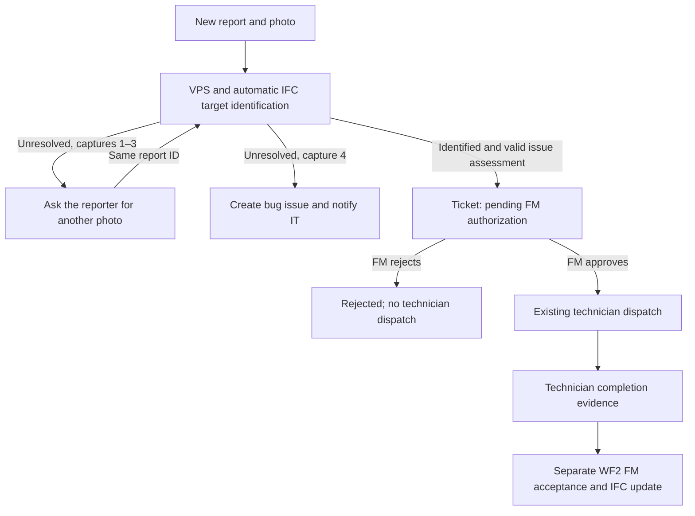

# Photo retries and FM authorization — release 2026.09.15

This release extends the existing `n8n_deploy` deployment and preserves its n8n data, credentials, ngrok configuration, case-study database and original IFC. The preceding `15_09_2026 CBM Case Study Demo` source release remains unchanged.

## The process



The limit is **three replacement photos after the initial photo: four captures total**. A failed capture records technical diagnostic information, never a maintenance ticket requiring FM asset selection. Failures of normalization, VPS, registration, the vision service or target identification follow this bounded retry process. A new photo cannot repair a missing registration or service outage; the fourth failure still produces the requested IT escalation. The retry message says this explicitly.

The IT recipient defaults to **giuseppe.desiderio123@gmail.com**, configurable through `itEmail` in `cbm/demo.local.json`. An exhausted report creates a durable `cbm_it_issues` record and queues its notification to IT. This is a database bug record plus email; it does not create an issue in an external tracker. The FM receives only a successfully identified maintenance request for business authorization.

## Update the existing deployment

Run PowerShell 7.3 or newer. Installation preserves `.env`, `cbm/cbm.env`, local demo settings, the registration file, the approved knowledge catalog and persistent volumes. It backs up the former application/configuration before replacing the deployment copy. Source releases and the original IFC/photos are preserved.

```powershell
Set-Location -LiteralPath 'C:\Users\USER\Desktop\Progetti Dottorato\ISTEA_2026\Progetto_ISTEA\15_09_2026 CBM Intake Approval Release'
.\scripts\deployment\Install-CbmExtension.ps1
Set-Location -LiteralPath 'C:\Users\USER\Desktop\n8n_deploy'
.\scripts\deployment\Start-Cbm.ps1
.\scripts\deployment\Test-Cbm.ps1
```

`scripts/deployment/Start-Cbm.ps1` runs `scripts/deployment/Apply-CbmIntakeMigration.ps1` after starting PostgreSQL. The migration first takes a database dump, then adds report/capture/bug/outbox tables and authorization columns. Existing Docker volumes are reused. PostgreSQL initialization scripts do not run again merely because an existing container restarts, which is why an explicit migration is supplied.

For a deployment whose containers have already been updated, run `scripts/deployment/Apply-CbmIntakeMigration.ps1` directly. It is repeatable and does not reset counters or tickets. Do not rerun the original release-review migration afterward: its old uniqueness predicate predates rejected requests.

The installer itself does not import or publish application workflows. Follow `DEPLOYMENT_STATUS.md` for what was actually installed and verified on this computer.

## Configure and import

Keep your current FM email and incoming/completed Drive folder IDs. Add or override the IT address:

```json
{
  "fmEmail": "YOUR_CONTROLLED_FM_EMAIL",
  "incomingFolderId": "YOUR_INCOMING_DRIVE_FOLDER_ID",
  "completedFolderId": "YOUR_COMPLETED_DRIVE_FOLDER_ID",
  "itEmail": "giuseppe.desiderio123@gmail.com"
}
```

Run `scripts/workflows/Prepare-CbmWorkflows.ps1`. It produces 14 inactive exports named `[CBM Intake Approval 2026.09.15] ...`, with IDs beginning `cbmIntake20260915`. Import the helper workflows before the main workflows, then bind the same PostgreSQL, Drive, Gmail, MultiSet, Anthropic and knowledge credentials described in the main tutorial. Do not import `workflow-ids.json`; it is a manifest.

WF1 now calls itself through `One Capture Input` once per Drive item. Keep `Process Each Drive Capture` set to **Run once for each item**, workflow `{{ $workflow.id }}`, and keep the workflow caller policy **workflows from the same owner**. This prevents two files from one poll from sharing capture metadata.

The obsolete `/cbm-wf1-resume` FM asset-editing route is removed. The new FM authorization route is `/cbm-wf1-authorize`, with separate GET and POST entry points. It uses an unpredictable, expiring email link and an explicit confirmation form; no additional FM Header Auth credential is needed. The existing technician offer route `/cbm-wf1-offer` remains. Unpublish older WF1 versions watching the same folder or serving conflicting paths before publishing the new version. Do not import over a previous release you want to retain.

## Demonstrate the app interaction through Drive

Prepare one original case-study photo, with its EXIF unchanged:

```powershell
.\scripts\demo\Prepare-CaseStudyPhotos.ps1 -ReporterEmail 'YOUR_CONTROLLED_REPORTER_EMAIL' -Photo 'IMG_7911.JPG'
```

The script prints a report UUID and writes `cbm/case-study/upload-ready/<UUID>/report_<email>_<UUID>_IMG_7911.jpg`. Upload that file to the watched Drive folder. The initial app loading state corresponds to `cbm_intake_reports.state = PROCESSING`.

If identification fails, the report moves to `AWAITING_PHOTO`. The one-minute recovery trigger sends the queued retry email; it contains the same UUID and remaining retry count. Prepare a different original image using that UUID:

```powershell
.\scripts\demo\Prepare-CaseStudyPhotos.ps1 -ReporterEmail 'YOUR_CONTROLLED_REPORTER_EMAIL' -Photo 'IMG_7915.JPG' -ReportId 'THE_UUID_FROM_THE_RETRY_MESSAGE'
```

Upload it as a **new Drive file**, preserving the reporter email and UUID. A rename/update of the existing Drive file does not fire this workflow's `fileCreated` trigger. Reprocessing the same Drive file ID does not consume a second attempt. Uploading a different file while the previous capture is still processing returns a busy notice without consuming a retry; wait for the result before uploading again. Counts are based on distinct accepted Drive file IDs, so reuploading identical image bytes under a new ID still consumes an attempt—take/select a genuinely different photo.

Repeat only when another photo is requested. After the third replacement fails, the report enters `IT_ISSUE`; IT receives the bug ID, report ID, attempt numbers, failure codes, map code and execution IDs. Additional uploads with that report UUID do not reset the counter or start a maintenance job. IT investigates the service/registration/identification problem; the FM is not asked to select a GlobalId. After IT resolves the problem, a fresh report may be started explicitly. There is no automatic reopening of exhausted reports.

The existing eleven-photo localization diagnostic remains separate and manual. It does not create reports, consume the report's retry budget or send notifications.

## Successful identification and the two FM decisions

With verified registration, `/case-study/resolve` supplies nearby IFC candidates. The existing vision-model call now also selects the photographed asset from that list. Code requires exactly one matching candidate, an explicit non-ambiguous identification, confidence of at least 0.8 and a written visual justification, plus valid maintenance-assessment fields. A proxy class is accepted. An invented GlobalId, ambiguous target or invalid assessment requests another photo.

The candidate list is spatial evidence; camera distance alone is never used as the final asset identity. This bounded model check is not a measured accuracy guarantee. The actual case-study registration remains unverified until you supply measured correspondences, and the model's live selections still need validation against the photos and IFC. This release does not fabricate either result.

A resolved new report creates `PENDING_AUTHORIZATION`. The FM email includes the automatically identified asset, description, severity and photo. Open the link to inspect the request, then explicitly **Approve intervention** or **Reject intervention**. Viewing the GET page does not change state. The form has no asset-selection or GlobalId-editing fields.

Approval is persisted atomically, moves the ticket to `LOCALIZED`, and starts the existing dispatch branch. A database trigger blocks new tickets from dispatch/assignment without authorization, including recovery and helper writes. Dispatch appointment calculations start from authorization time. Rejection sets `REJECTED`, informs the reporter and creates no technician offer. A later legitimate report on that asset can create a fresh request.

The link expires after 72 hours. Expiry leaves the request pending; the recovery trigger issues a new token/link. Old, repeated or conflicting decisions cannot authorize the ticket. A duplicate report about an existing open asset is linked to its existing ticket and does not start another job or another approval request.

After intervention, use the existing WF2 process: optional after-photo, then `TICKET-<id>.pdf`; the FM separately accepts completion or requests rework. Only accepted completion permits closure and the existing versioned IFC write. WF2's acceptance logic is unchanged. WF3 now excludes `REJECTED` requests from open-work totals and recognizes `PENDING_AUTHORIZATION`.

## Inspect state and notifications

From `n8n_deploy`, open the application database without exposing its password:

```powershell
.\scripts\deployment\Cbm-Compose.ps1 exec cbm-postgres psql -U cbm_app -d cbm_demo
```

Useful read-only queries:

```sql
SELECT id,state,attempts,ticket_id FROM cbm_intake_reports ORDER BY created_at DESC;
SELECT report_id,attempt,file_id,status,reason FROM cbm_capture_attempts ORDER BY started_at DESC;
SELECT id,report_id,status,summary FROM cbm_it_issues ORDER BY created_at DESC;
SELECT id,status,ifc_global_id,dispatch_authorized_at,technician_id FROM tickets ORDER BY id DESC;
SELECT id,kind,status,message_id FROM cbm_intake_outbox ORDER BY id DESC;
```

The one-minute tick sends one queued notice per run, prioritizing IT bugs. A batch may therefore wait several minutes. Messages are claimed before sending and marked `SENT` only when Gmail returns a message ID. Missing/failed receipts become `UNCERTAIN`; reconcile the n8n execution and Gmail before manually resending. There is no automatic resend of uncertain delivery. A capture whose execution disappears is failed with `CAPTURE_TIMEOUT` after ten minutes, preserving the same retry budget.

## Validation

The isolated n8n 2.29.9 test uses a local HTTP simulator for VPS, vision and mail. It verified four-capture exhaustion, PostgreSQL restart persistence, duplicate/extra uploads, batch isolation, both real proxy IDs through simulated target selection, ambiguous/invented-ID/outage rejection, read-only approval GET, HTML escaping, approve/reject/replay handling, dispatch entry only after approval, and notification receipts. Separate PostgreSQL tests exercise concurrent captures, concurrent same-asset reports, link renewal and the dispatch guard. The existing real-IFC import/write/replay tests also pass on disposable model copies.

These tests do not claim a live MultiSet success rate, actual vision accuracy, email delivery or completion of a provider-dependent maintenance lifecycle. See `cbm/case-study/validation/intake-runtime.json` and the deployment status for the recorded evidence.
