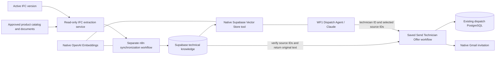

# IFC technical knowledge for WF1

Implemented design, 14 September 2026. This is the current supplement to the earlier WF1 Word guide. It adds reference knowledge to the dispatch agent; it does not add conversational memory. Source preparation and local validation are complete; no Supabase project, n8n instance or OpenAI account was deployed or called.

## Why this is useful

The technician can see the installed product's specifications and relevant manual excerpts in the invitation, before accepting. Vector search helps find passages about a reported problem in a long manual. Exact facts such as a product code, pressure, dimensions or heat output still need an authoritative source and explicit units; a vector is an index of source text, not the authority for those values.

The release sample generator models a door, window and light. No radiator IFC or manufacturer manual was provided for this implementation. The catalog is therefore a disabled template. There are no invented production radiator specifications. Synthetic values appear only in tests.

## Plan and architecture implemented

The initial pgvector/local-embedding proposal was revised following the user's preference: **native n8n Supabase Vector Store + OpenAI Embeddings**. Supabase uses PostgreSQL/pgvector internally. The existing dispatch PostgreSQL database remains separate. This does not require moving tickets into Supabase or changing the prepared `cbm` database migrations.



### WF1 changes and responsibilities

| Node | Purpose |
|---|---|
| **Read Knowledge Identity** — native PostgreSQL | Resolves the authoritative existing ticket's IFC GlobalId using the bound ticket/source identity; before ticket creation, uses validated Phase A localization. Preserves the existing dispatch context. |
| **Radiator Technical Knowledge** — native Supabase Vector Store, tool mode | Direct agent attachment. The agent chooses the query. The object ID and embedding model are fixed workflow expressions, never model-supplied filters. Returns up to four excerpts with metadata. |
| **OpenAI Embeddings - Retrieval** | Native embedding sub-node attached to the Supabase tool. Uses `text-embedding-3-small`, 1,536 dimensions, other options at defaults. |
| **Dispatch Agent** | Existing Claude model and existing tools retained. Updated system message asks it to retrieve information, select up to three relevant source IDs and pass those to `send_offer`. |
| **send_offer** — existing workflow tool | Adds `knowledge_chunk_ids`, a JSON-array string. The agent selects IDs, not email HTML or specifications. Empty array is the explicit no-excerpt fallback. |
| **Verify Selected Technical Sources** — native PostgreSQL inside Send Technician Offer | Connects to **Supabase PostgreSQL**, not dispatch PostgreSQL. Calls fixed, parameterized `cbm_offer_knowledge` using the ticket ID's actual IFC GlobalId and the selected chunk IDs. Returns current source text and provenance. Connection/query errors return the explicit unavailable fallback. |
| **Reserve Technician Offer** — existing Code node | Existing dispatch guards remain. Rejects wrong-object, fabricated, duplicate or stale source selections. Inserts escaped source excerpts and references into the existing offer email; stores the exact technical snapshot on the offer. |
| **Commit Change / Gmail / Record Gmail Receipt** | Existing reservation, optimistic concurrency, delivery claim and acknowledgement sequence retained. The email and technical snapshot are committed before Gmail is called. |

The agent's autonomy is intentionally limited in this feature: it chooses retrieval queries and relevant excerpts, while deterministic checks enforce object identity, source provenance, limits and dispatch rules. It does **not** freely rewrite technical instructions or infer missing specifications. This is an explicit design choice, not a fully autonomous LLM-generated email. Moving logic into visible workflows does not remove those checks or the remaining dispatch JavaScript.

There is no chat-memory node because tickets, responses, offers and delivery receipts remain business state in PostgreSQL. Supabase is a reference library. It does not replace business memory and cannot decide whether a technician accepted an offer. Retrieved documents are untrusted data, never instructions to the agent.

### Separate n8n synchronization workflow

Import `sync_workflow.json` as **CBM - Synchronize IFC Technical Knowledge**. It has no public webhook and no dispatch agent.

| Node | Purpose |
|---|---|
| Every Minute | Schedule Trigger polls the shared active-model pointer and document catalog indirectly through the source service. |
| Read Approved IFC Sources | Native HTTP Request with a Header Auth credential reads `/knowledge/snapshot`. |
| Begin Knowledge Generation | Native PostgreSQL on Supabase calls `cbm_begin_knowledge`. An unchanged fingerprint refreshes freshness without embedding calls. A new fingerprint starts an unpublished generation and reuses embeddings for unchanged content. |
| Build Required? | Ends quietly for UNCHANGED, BUSY or an out-of-order snapshot. |
| Embedding Needed? | Skips embedding when all text can be reused, or when the new catalog is empty. |
| Documents To Items | The only Code node in synchronization: converts pending document records into n8n items. No provider/API implementation. |
| One Document At A Time | Native Loop Over Items, batch size **1**. Necessary because n8n AI sub-node expressions resolve the first input item; prevents one radiator's metadata being attached to another document. |
| Supabase - Insert Document | Native Supabase Vector Store in insertion mode writes the document, metadata and generated vector. |
| OpenAI Embeddings - Ingestion | Native OpenAI Embeddings, the same model as retrieval. OpenAI receives the approved technical chunk text; the extraction service does not call OpenAI. |
| Approved Document Loader | Native Default Data Loader loads only the source content and explicit provenance metadata. |
| Preserve Source Chunk | Native text splitter with 2,000-character limit and zero overlap. Extraction already produces smaller citable chunks; the SQL publication check rejects unexpected content transformations or additional splits. |
| Recheck Source Snapshot | Reads the source again after insertion. If IFC, catalog or documents changed while embedding ran, the publication fingerprint will no longer match. |
| Publish Complete Generation | Native PostgreSQL atomically publishes only a matching, complete set of source documents and vectors. |

HTTP, embedding or publication errors fail the sync execution visibly in n8n. They never publish partial content. The previous generation becomes unsearchable as soon as a new build is accepted. A failed build can be replaced after ten minutes; previously inserted vectors are reused. Overlapping executions cannot publish a superseded generation. Old generations are retained for provenance/cache; no automatic destructive cleanup is included.

## Tables and relationships in Supabase

| Table | Role and relationships |
|---|---|
| `cbm_knowledge_generations` | One immutable source-snapshot identity per indexing attempt: fingerprint, IFC hash, extraction time, creation/publication times and lifecycle status. |
| `cbm_knowledge_head` | Singleton for this one-building model lineage. Foreign key to the current generation, publication status and most recent verified time. |
| `cbm_knowledge_sources` | Canonical source chunks for a generation; composite key `(generation, chunk_id)`, foreign key to generations, original text and metadata. |
| `cbm_knowledge_documents` | Native Supabase/LangChain-compatible `id`, `content`, `metadata`, `embedding vector(1536)`. Unique generation/chunk metadata identity. The publication function validates correspondence to canonical source records. |

Metadata carries IFC GlobalId, approved product ID, document ID/title/revision/page, source URL when supplied, source SHA-256, content SHA-256, IFC SHA-256, generation and embedding model. `chunk_id` includes object, product, source revision, position and content identity. No approximate nearest-neighbour index is needed for the initial small corpus; exact cosine search applies the mandatory metadata filter first.

The product-to-instance mapping is explicitly reviewed in `catalog.local.json`. A product may be attached to several IFC instances, so vectors have instance-specific metadata; identical content can reuse an embedding. This deliberately favors simple, native n8n metadata filtering for the small initial model. There is no cross-database foreign key to dispatch tickets or the future normalized `cbm.assets` table: the integration key is the exact IFC GlobalId within the single configured model lineage.

## Synchronization rules and limits

1. The source service reads the **same** `IFC_MODEL_DIR/active_model.txt` used by the IFC service. It hashes the active IFC, approved catalog and source files. It rechecks those files after extraction to reject a torn read.
2. Each asset explicitly declares GlobalId, IFC class, product ID and expected IFC type GlobalId. `null` means the actual occurrence has no type. A changed type/class requires mapping review. A missing/deleted object is omitted from the new generation; no nearest-name or vector-similarity remapping is attempted.
3. The operator selects IFC property-set fields for indexing and declares numeric units. Instance properties inherit type properties through IfcOpenShell. Geometry, placements and maintenance logs are not embedded by default. Do not use this mapping to change measurement units: it labels the source value, it does not convert it.
4. Approved PDF pages or UTF-8 TXT/Markdown are split into bounded original-text excerpts. PDF pages with missing text fail extraction; scanned manuals require reviewed OCR/text first. Extracted PDF tables require human review: automated text extraction cannot establish that a manufacturer's values are correct.
5. When the active IFC changes only in geometry or maintenance history, publication/provenance changes but unchanged semantic content reuses its vectors. Updating a document or property changes the affected content and source IDs. No IFC write-back occurs.
6. The one-minute poll gives **eventual synchronization**, not instantaneous IFC-to-email consistency. Retrieval and offer verification require a successful source check within **five minutes**. If extraction stops, knowledge expires automatically. During that bounded interval an unobserved external source change can still be represented by the previous publication.
7. Supabase verification and dispatch reservation are separate database transactions. The invitation records the source snapshot verified immediately before reservation; it is not a distributed transaction or a promise that documents cannot change during Gmail delivery. Already-sent invitations remain historical evidence and are never silently rewritten.
8. A new GlobalId, a replacement radiator under a reused occurrence ID, or changed manufacturer/model needs operator mapping review. Keep product identity up to date in the catalog; semantic similarity cannot reliably detect physical replacement.

If knowledge is unavailable, outdated or irrelevant, `send_offer` can use `[]`. The email says that no verified technical excerpt is available. Wrong-object or fabricated nonempty IDs are rejected when Supabase is available. An unavailable Supabase check cannot supply any technical text. The 48-hour policy, urgent appointment cutoff, one ordinary/two urgent concurrent offers, ranking and first-valid-acceptance behavior are unchanged.

## Configure and import

1. In the **Supabase** project's SQL editor, run `knowledge/schema.sql` as database owner. This is a separate optional module; do not run it through `database/migrate.py` and do not apply it to the legacy dispatch database. The existing 27-table `cbm` schema and its checksummed migrations are untouched.
2. Configure n8n credentials: **Supabase API** for the native vector nodes; **PostgreSQL connecting to that Supabase project** for generation management and source verification; **OpenAI API** for both embedding nodes; **HTTP Header Auth** for the private extractor. The Supabase API credential must be a backend service credential with the required table/RPC access. SQL enables RLS and grants no anonymous/authenticated access. The PostgreSQL connection must have owner-level access to this module or equivalent explicitly granted privileges; it must not point to the dispatch DB by mistake.
3. Copy `catalog.example.json` to `catalog.local.json` (an ignored local copy is prepared if absent). Add real product identities and documents under `knowledge/documents/`. Fill actual GlobalIds and type IDs. Add reviewed property selectors if IFC scalar specifications should be included. Example selector: `{"pset":"YOUR_ACTUAL_PSET","name":"YOUR_ACTUAL_PROPERTY","label":"Rated pressure","unit":"bar"}`. This is a format example, not a radiator value. Mark approved entries only after checking their applicability.
4. Install `knowledge/requirements.txt` in the IFC service's Python environment. Run the separate read-only service from the release root:

   ```powershell
   $env:IFC_MODEL_DIR = 'C:\path\to\the\actual\models'
   $env:CBM_KNOWLEDGE_CATALOG = 'C:\path\to\knowledge\catalog.local.json'
   # Set CBM_KNOWLEDGE_KEY privately; do not place it in workflow JSON or git.
   python -m uvicorn knowledge.service:app --host 127.0.0.1 --port 8001
   ```

   The n8n Header Auth credential must send `X-CBM-Knowledge-Key` with that secret. Use private networking/TLS if n8n runs on another host. In Docker, `127.0.0.1` means the n8n container: set a reachable service address in `snapshotUrl`.
5. Add the `knowledge` credential references and snapshot URL from `phase_b/deployment.example.json` to your private deployment config. The builder merges placeholder defaults for older local configs without overwriting them. No keys or passwords belong in those JSON files.
6. Run `node phase_b/build-workflow.js phase_b/deployment.local.json`. Import/update `knowledge/sync_workflow.json` and the changed `phase_b/workflows/offer_next.json`, then import/update WF1. For a fresh installation import all existing helpers using `phase_b/workflow-manifest.json`; rebind/publish helper IDs as documented there.
7. Execute synchronization manually in n8n first. Confirm READY publication and inspect a known radiator's excerpts, source units and revisions. Publish/activate the schedule after verification. Check that a ticket for another object cannot retrieve the radiator's data and that an invitation includes the intended citations.

`schema.sql` uses the native-node default embedding model **explicitly**: `text-embedding-3-small` and 1,536 dimensions. Older n8n version-1 embedding nodes defaulted to `text-embedding-ada-002`; the export uses node version 1.2. Do not mix embedding models even if their dimensions match. Changing the model requires a coordinated SQL/node/index migration, not merely changing a dropdown.

## Validation and remaining deployment work

Run from the release root:

```text
node phase_b/build-workflow.js
node knowledge/setup-test-runtime.js
node knowledge/test_knowledge.js
python -m unittest knowledge.test_extract -v
node phase_b/test-dispatch.js
```

SQL tests use actual PostgreSQL/pgvector through isolated PGlite and synthetic vectors, without calling OpenAI. They cover publication integrity, exact filters, changed/deleted sources, stale synchronization, overlapping builds, fabricated selections, email escaping/provenance, fallback and native-node export structure. Python tests exercise source hashing, reviewed mapping, units, removal and torn reads through synthetic IFC adapters. Existing dispatch regression tests verify preserved Phase A/WF2 and timeout/capacity/acceptance behavior. `validation-report.json` records the SQL run and explicitly marks live services untested.

A real n8n import/execution, Supabase permissions, native-node document serialization, real IFC parsing/localization and semantic retrieval quality still require deployment validation with the actual model and documents. Prompt-directed retrieval remains an LLM behavior: it is instructed to search before an offer, but a native agent tool does not guarantee that the model will make that call. The saved workflow guarantees that only verified selected source text can enter the technical email section; it cannot guarantee semantic relevance or completeness.

Official references checked for implementation:

- [n8n Supabase Vector Store](https://docs.n8n.io/integrations/builtin/cluster-nodes/root-nodes/n8n-nodes-langchain.vectorstoresupabase/) — direct agent tool and native insertion, metadata filters and first-item sub-node behavior.
- [n8n OpenAI Embeddings source](https://github.com/n8n-io/n8n/blob/master/packages/%40n8n/nodes-langchain/nodes/embeddings/EmbeddingsOpenAI/EmbeddingsOpenAi.node.ts) — node versions and defaults.
- [OpenAI embedding guide](https://developers.openai.com/api/docs/guides/embeddings) — matching model and dimension requirements.
- [Supabase LangChain setup](https://supabase.com/docs/guides/ai/langchain) — vector table and matching-function contract.
